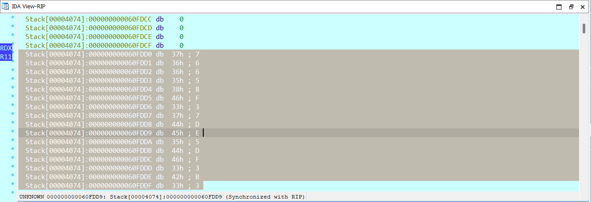

# HelloRE
## Mô tả


Chương trình yêu cầu chúng ta nhập mật mã và kiểm tra mật mã nhập vào là đúng hay sai.
## Giải
Ý tưởng của bài này là tìm chuỗi kí tự `Không chính xác` như trong hình và lần ngược lại xem chương trình hoạt động như thế nào. Đây cũng là phần khó nhất vì chuỗi kí tự này có định dạng UTF-16 thay vì UTF-8 như thông thường. 
Tôi đã tìm chuỗi kí tự này trong IDA bằng cách encode "Không" theo định dạng UTF-16 và tìm chuỗi byte này bằng tính năng Search sequence of bytes.


từ đó ta tìm được đây là hàm in ra messagebox "Không chính xác!"

```c
int __thiscall sub_862390(CWnd *this)
{
  const wchar_t *v2; // eax
  char *v3; // edx
  char *v4; // eax
  unsigned int v5; // esi
  bool v6; // cf
  bool v7; // zf
  const wchar_t *v8; // eax
  size_t PtNumOfCharConverted; // [esp+4h] [ebp-48h] BYREF
  char Dst[16]; // [esp+8h] [ebp-44h] BYREF
  __m128i v12; // [esp+18h] [ebp-34h]
  __m128i v13; // [esp+28h] [ebp-24h]
  __m128i v14; // [esp+38h] [ebp-14h]

  CWnd::UpdateData(this, 1);
  v2 = (const wchar_t *)*((_DWORD *)this + 43);
  if ( *((int *)v2 - 1) > 1 )
  {
    sub_862D20(*((_DWORD *)v2 - 3));
    v2 = (const wchar_t *)*((_DWORD *)this + 43);
  }
  wcstombs_s(&PtNumOfCharConverted, Dst, 0x40u, v2, 0x40u);
  v3 = Dst;
  v4 = (char *)&unk_A22810;
  v5 = 39;
  *(__m128i *)Dst = _mm_xor_si128((__m128i)xmmword_A05A50, *(__m128i *)Dst);
  v12 = _mm_xor_si128((__m128i)xmmword_A05A50, v12);
  v13 = _mm_xor_si128((__m128i)xmmword_A05A50, v13);
  v14 = _mm_xor_si128((__m128i)xmmword_A05A50, v14);
  do
  {
    if ( *(_DWORD *)v3 != *(_DWORD *)v4 )
      goto LABEL_8;
    v3 += 4;
    v4 += 4;
    v6 = v5 < 4;
    v5 -= 4;
  }
  while ( !v6 );
  if ( *(_WORD *)v3 != *(_WORD *)v4 || (v7 = v3[2] == v4[2], v8 = &word_A054BC, !v7) )
LABEL_8:
    v8 = (const wchar_t *)&unk_A054D4;
  return AfxMessageBox(v8, 0, 0);
}
```

Để ý dòng  
>char Dst[16];

khai báo một mảng kiểu char có 16 phần tử
sau đó mảng này được resize bằng hàm 
> wcstombs_s(&PtNumOfCharConverted, Dst, 0x40u, v2, 0x40u);

để nó có tất cả 64 phần tử
sau đó mảng này được đem xor với `xmmword_A05A50` , kết quả thu được sẽ được mang đi so sánh với v4. nếu bằng nhau thì in ra kết quả `Chính xác!`

Mặt khác giá trị của v4 tìm được là:


Vậy ta có chương trình tìm key:
```py
hex_string = "15712E21722F271D36721D362A711D107134713031711D712c25732C717130732c7B1D3572302E26636363"

# Chuyển chuỗi hex thành list các byte
hex_bytes = bytes.fromhex(hex_string)

# XOR từng byte với 42
result_bytes = bytes([byte ^ 0x42 for byte in hex_bytes])

# Chuyển kết quả thành chuỗi ASCII
result_ascii = result_bytes.decode("ascii")

print(result_ascii)

```

# keyInput
## Mô tả
Ở bài này chúng ta phải nhập 1 username và tìm password ứng với username ấy.
Chọn username là `hieuvd`
## Giải
Đầu tiên chúng ta nghĩ ngay đến việc tìm hàm main

```c
int __cdecl main(int argc, const char **argv, const char **envp)
{
  char v4[16]; // [rsp+20h] [rbp-50h] BYREF
  char v5[16]; // [rsp+30h] [rbp-40h] BYREF
  int v6[5]; // [rsp+40h] [rbp-30h] BYREF
  unsigned int v7; // [rsp+54h] [rbp-1Ch]
  void *Block; // [rsp+58h] [rbp-18h]
  char *Str; // [rsp+60h] [rbp-10h]
  int i; // [rsp+6Ch] [rbp-4h]

  sub_4026F0(argc, argv, envp);
  v6[0] = -2093140941;
  v6[1] = 10434719;
  v6[2] = 597222991;
  v6[3] = 1098567481;
  Str = (char *)malloc(0x100ui64);
  Block = malloc(0x100ui64);
  printf("Username: ");
  sub_40158F(Str);
  printf("Key: ");
  sub_40158F(Block);
  v7 = strlen(Str);
  sub_401852(v5, Str, v7, v6);
  for ( i = 0; i <= 7; ++i )
    sub_401540(&v4[2 * i], 16i64, "%02X", (unsigned __int8)v5[i]);
  if ( (unsigned int)sub_401662(Block, v4) )
    puts("OK");
  free(Str);
  free(Block);
  return 0;
}
```


`(unsigned int)sub_401662(Block, v4)` có vẻ làm 1 hàm kiểm tra key của chương trình. ta debug chương trình và đặt breakpoint tại đây.
Xét khối code chứa hàm này

ta thấy bên trong hàm này so sánh giá trị ở bên trong rdx và rax. 
Trong đó rax là giá trị mà ta nhập vào. vậy thì rdx rất có thể sẽ là key của chương trình.
và ta có giá trị bên trong `rdx`: `76658F37DF5DF3B3`



Ngoài ra để ý khối code này:
```
__int64 __fastcall sub_401662(__int64 a1, __int64 a2)
{
  int v3; // [rsp+2Ch] [rbp-4h]

  v3 = 0;
  do
  {
    if ( !(unsigned int)sub_4015F8((unsigned int)*(char *)(v3 + a1)) )
      return 0i64;
    if ( *(_BYTE *)(v3 + a1) != *(_BYTE *)(v3 + a2)
      && *(char *)(v3 + a1) != *(char *)(v3 + a2) + 32
      && *(char *)(v3 + a1) + 32 != *(char *)(v3 + a2) )
    {
      return 0i64;
    }
    ++v3;
  }
  while ( *(_BYTE *)(v3 + a1) && *(_BYTE *)(v3 + a2) );
  return 1i64;
}
```

Ta thấy hàm `sub_401662` lần lượt kiểm tra từng kí tự trong chuỗi nhập vào, chỉ cần tất cả các kí tự trong chuỗi nhập vào thỏa mãn thì không cần kết thúc chuỗi ta vẫn có thể in ra được `OK!`
=> có tất cả 16 keys của bài này là
`7`
`76`
`766`
`7665`
`76658`
`76658F`
`76658F3`
`76658F37`
`76658F37D`
`76658F37DE`
`76658F37DE5`
`76658F37DE5D`
`76658F37DE5DF`
`76658F37DE5DF3`
`76658F37DE5DF3B`
`76658F37DE5DF3B3`


# Malware
## Mô tả
- Cho vào Die ta thấy nó là 1 file PE32

khả năng cao là bị packed

## Giải
- Kiểm tra ipconfig của máy ảo


- Sử dụng Wireshark ta thấy socket này liên tục gửi thông tin từ default gateway đến `192.168.88.255`


- Điều này khá đáng ngờ vì đây giống như tính persistant của malware khi liên tục gửi thông tin về máy chủ của chúng.
Để kiểm tra điều này ra sử dụng ipconfig/flushdns


Lúc này con malware sẽ phải tìm tên miền của nó với dns resolver. Ta thấy có 2 gói tin được gửi đến với giao thức DNS


và tên miền của chúng là u.lewd.se
như vậy đây chính là tên miền máy chủ của mã độc


Ta thấy khi bấm chạy chương trình thì nó tự động biến mất. 
Vậy đầu tiên chúng ta debug xem chương trình hoạt động như thế nào.

Bắt đầu từ hàm start, ta có:
```c
void start()
{
  char v0; // bl
  const WCHAR *v1; // eax
  LPWSTR *v2; // eax
  int i; // edx
  LPWSTR v4; // ecx
  int v5; // ecx
  char v6; // al
  int v7; // [esp+4h] [ebp-10h]
  HANDLE hObject; // [esp+8h] [ebp-Ch]
  int pNumArgs; // [esp+Ch] [ebp-8h] BYREF
  char v10; // [esp+13h] [ebp-1h]

  v0 = 0;
  if ( !(unsigned __int8)sub_41C53B(0) )
LABEL_25:
    ExitProcess(v0 == 0);
  LOBYTE(v7) = 0;
  LOBYTE(hObject) = 1;
  v10 = 0;
  SetErrorMode(0x8007u);
  v1 = GetCommandLineW();
  v2 = CommandLineToArgvW(v1, &pNumArgs);
  if ( !v2 )
    goto LABEL_20;
  for ( i = 0; i < pNumArgs; ++i )
  {
    v4 = v2[i];
    if ( v4 && *v4 == 45 )
    {
      v5 = v4[1];
      switch ( v5 )
      {
        case 'f':
          LOBYTE(v7) = 1;
          break;
        case 'i':
          v0 = 1;
          break;
        case 'n':
          LOBYTE(hObject) = 0;
          break;
        case 'v':
          v10 = 1;
          break;
      }
    }
  }
  LocalFree(v2);
  if ( v0 )
  {
    v6 = sub_41CF7B();
LABEL_21:
    v0 = v6;
    goto LABEL_22;
  }
  if ( !v10 )
  {
LABEL_20:
    v6 = sub_41D16A(v7, hObject);
    goto LABEL_21;
  }
  sub_40D74C();
  v0 = sub_4179C2();
  if ( (dword_4239B0 & 4) != 0 )
    sub_40D5C5(0);
LABEL_22:
  if ( !v0 || (dword_4239B0 & 2) == 0 )
    goto LABEL_25;
  Sleep(0xFFFFFFFF);
}
```
Hàm này kiểm tra số tham số truyền vào và thực hiện một số hành động dựa trên kết quả của sự kiểm tra này.
Debug thì phát hiện file `svchost.exe`bị xóa sau khi chương trình chạy lệnh:
> v6 = sub_41D16A(v7, hObject);

Tiếp tục đi sâu hơn vào hàm này, ta có:
```c

char __stdcall sub_41D16A(int a1, HANDLE hObject)
{
  HANDLE v2; // eax
  void *v3; // edi
  int v4; // eax
  HANDLE v5; // eax
  HANDLE v6; // edi
  char arglist[520]; // [esp+Ch] [ebp-294h] BYREF
  char v9[116]; // [esp+214h] [ebp-8Ch] BYREF
  WCHAR Name[50]; // [esp+288h] [ebp-18h] BYREF
  HANDLE hHandle; // [esp+2ECh] [ebp+4Ch] BYREF
  HANDLE v12; // [esp+2F0h] [ebp+50h]
  void *v13; // [esp+2F4h] [ebp+54h]
  HANDLE hMutex; // [esp+2FCh] [ebp+5Ch]
  LPVOID lpMem; // [esp+300h] [ebp+60h]
  HANDLE Handles; // [esp+304h] [ebp+64h] BYREF
  LPVOID FileInformation; // [esp+308h] [ebp+68h] BYREF
  char Buffer; // [esp+30Fh] [ebp+6Fh] BYREF
  HANDLE hObjecta; // [esp+31Ch] [ebp+7Ch]

  Buffer = 0;
  if ( (unsigned __int8)sub_40A402(pSrc) )
  {
    FileInformation = v13;
    lpMem = (LPVOID)sub_41CDE5(v12);
    if ( !lpMem )
      FileInformation = 0;
    sub_40A4AA();
  }
  if ( FileInformation == (LPVOID)486 )
  {
    if ( (unsigned __int8)sub_40C4A5(lpMem) )
    {
      sub_41C946(848302384, Name, 1);
      hObjecta = CreateMutexW(&MutexAttributes, 1, Name);
      if ( hObjecta )
      {
        if ( GetLastError() == 183 )
        {
          CloseHandle(hObjecta);
          hObjecta = 0;
        }
        if ( hObjecta )
        {
          sub_41D56B(v9);
          if ( (v9[0] & 0x20) != 0 )
            dword_4239B0 |= 0x10u;
          sub_404FF7();
          if ( (dword_4239B0 & 0x10) != 0 )
            ExitWindowsEx(0x14u, 0x80000000);
          sub_41C946(440619839, Name, 1);
          v2 = OpenEventW(2u, 0, Name);
          v3 = v2;
          if ( v2 )
          {
            SetEvent(v2);
            CloseHandle(v3);
          }
          sub_41CEA2(1);
          Buffer = 1;
          CloseHandle(hObjecta);
        }
      }
    }
  }
  else if ( FileInformation == (LPVOID)12 )
  {
    hMutex = (HANDLE)sub_41C97E(-2004274053, 2);
    if ( hMutex )
    {
      sub_41C946(422999041, Name, 1);
      if ( (unsigned __int8)sub_4089C9(Name) )
      {
        while ( 1 )
        {
          Buffer = 0;
          if ( ReadProcessMemory((HANDLE)0xFFFFFFFF, GetFileAttributesExW, &Buffer, 1u, 0) )
          {
            if ( Buffer == -23 )
              break;
          }
          Sleep(0x1F4u);
        }
      }
      if ( IsWellKnownSid(*(PSID *)dword_4239B4, WinLocalSystemSid) )
      {
        Buffer = sub_40C874();
      }
      else
      {
        Buffer = 0;
        if ( ReadProcessMemory((HANDLE)0xFFFFFFFF, GetFileAttributesExW, &Buffer, 1u, 0)
          && Buffer == -23
          && GetFileAttributesExW(sz, (GET_FILEEX_INFO_LEVELS)2029085536, &FileInformation) )
        {
          sub_40B607(*((_DWORD *)lpMem + 2), *(_DWORD *)lpMem);
          Buffer = ((int (__fastcall *)(LPVOID, WCHAR *, char *, int))loc_40C55C)(FileInformation, &psz1, arglist, a1);
          VirtualFree(FileInformation, 0, 0x8000u);
        }
        else
        {
          sub_40B607(*((_DWORD *)lpMem + 1), *(_DWORD *)lpMem);
          Buffer = ((int (__fastcall *)(WCHAR *, char *))loc_40C1F0)(&psz1, arglist);
        }
        if ( Buffer == 1 )
        {
          v4 = sub_406AAD((char)arglist, 0, (int)&psz1, 0, (int)&hHandle);
          Buffer = v4 != 0;
          if ( v4 )
          {
            sub_41C946(440619839, Name, 1);
            v5 = CreateEventW(&MutexAttributes, 1, 0, Name);
            v6 = hHandle;
            Handles = v5;
            FileInformation = hHandle;
            if ( v5 )
              WaitForMultipleObjects(2u, &Handles, 0, 0xFFFFFFFF);
            else
              WaitForSingleObject(hHandle, 0xFFFFFFFF);
            if ( Handles )
              CloseHandle(Handles);
            CloseHandle(v12);
            CloseHandle(v6);
          }
        }
      }
      sub_4089B9(hMutex);
    }
    if ( (_BYTE)hObject == 1 )
      sub_406C4B(pSrc);
  }
  sub_4051E6(lpMem);
  return Buffer;
}
```
Khá lằng nhằng nhưng những gì chúng ta cần chú ý là tại dòng này chương trình tiếp tục làm biến mất file
> v4 = sub_406AAD((char)arglist, 0, (int)&psz1, 0, (int)&hHandle);

lại đi vào trong hàm này tiếp
```c
DWORD __stdcall sub_406AAD(char arglist, LPVOID lpMem, int a3, int a4, int a5)
{
  DWORD v5; // esi
  int v6; // eax

  v5 = 0;
  if ( lpMem )
    v6 = sub_405F54((int)&lpMem, L"\"%s\" %s", arglist);
  else
    v6 = sub_405F54((int)&lpMem, L"\"%s\"", arglist);
  if ( v6 > 0 )
  {
    v5 = sub_406A2D((struct _STARTUPINFOW *)a4, (WCHAR *)lpMem, (const WCHAR *)a3, a5);
    sub_4051E6(lpMem);
  }
  return v5;
}
```

làm tương tự với 
>v5 = sub_406A2D((struct _STARTUPINFOW *)a4, (WCHAR *)lpMem, (const WCHAR *)a3, a5);

```c
DWORD __userpurge sub_406A2D@<eax>(struct _STARTUPINFOW *a1@<eax>, WCHAR *a2, const WCHAR *lpCurrentDirectory, int a4)
{
  int v4; // edx
  WCHAR *v5; // ecx
  int v7[17]; // [esp+4h] [ebp-58h] BYREF
  struct _PROCESS_INFORMATION ProcessInformation; // [esp+48h] [ebp-14h] BYREF
  WCHAR CommandLine; // [esp+58h] [ebp-4h] BYREF

  CommandLine = 0;
  if ( !a1 )
  {
    sub_405299(v7, 0, 68);
    v7[0] = v4;
    a1 = (struct _STARTUPINFOW *)v7;
  }
  v5 = &CommandLine;
  if ( a2 )
    v5 = a2;
  if ( !CreateProcessW(0, v5, 0, 0, 0, 0x4000000u, 0, lpCurrentDirectory, a1, &ProcessInformation) )
    return 0;
  if ( a4 )
  {
    sub_405222(a4, &ProcessInformation, 16);
  }
  else
  {
    CloseHandle(ProcessInformation.hThread);
    CloseHandle(ProcessInformation.hProcess);
  }
  return ProcessInformation.dwProcessId;
}
```

Khi đến dòng `CreateProcessW(0, v5, 0, 0, 0, 0x4000000u, 0, lpCurrentDirectory, a1, &ProcessInformation)`, máy tính hiện cảnh báo về kết nối mạng của file mới được sinh ra.
Kiểm tra từng tham số của hàm tại thời điểm debug, ta thấy 
v5 = "C:\Windows\system32\cmd.exe" và 
ProcessInformation = "C:\Users\Grass\Appdata\Roaming\Exomus\oryk.exe"
ta có thể đoán đây là đường dẫn đến file mới được sinh ra.
thật vậy, sau đó máy tính cảnh báo:

Lưu ý là trong hàm bên trên có phần kiểm tra xem đã có file được tạo ra ở bên trong C:\Users\Grass\Appdata\Roaming chưa. Trong trường hợp đã có rồi thì nó sẽ không tạo ra thêm nữa.


Đi tiếp một hồi thì ta tìm được file bat để thủ tiêu dấu vết của chương trình.
```bat
@echo off
:d
del "C:\Users\Grass\Downloads\svchost - Copy (10).exe"
if exist "C:\Users\Grass\Downloads\svchost - Copy (10).exe" goto d
del /F "C:\Users\Grass\AppData\Local\Temp\tmp64a576d8.bat"
```

Như vậy ở đây suy đoán của tôi là chương trình sẽ tạo ra 1 file mới tên là `oryk`, sau đó xóa file `svchost` bằng 1 file bat và xóa luôn file .bat đấy đi.

Bây giờ chúng ta đi phân tích file `oryk.exe`.
> if ( !(unsigned __int8)sub_41C53B(0) )

đây là hàm tạo registry key và tạo ra thread liên tục bắn request lên server.
Đây là đoạn code thực hiện 2 chức năng này:
```c
int __userpurge SENDDDDD@<eax>(SOCKET a1@<ebx>, SOCKET a2)
{
  SOCKET v2; // eax
  int result; // eax
  char buf[1024]; // [esp+8h] [ebp-49Ch] BYREF
  fd_set readfds; // [esp+408h] [ebp-9Ch] BYREF
  int v6; // [esp+50Ch] [ebp+68h]
  SOCKET v7; // [esp+510h] [ebp+6Ch]
  int v8; // [esp+514h] [ebp+70h]

LABEL_9:
  while ( 1 )
  {
    readfds.fd_array[1] = a2;
    readfds.fd_count = 2;
    readfds.fd_array[0] = a1;
    result = select(0, &readfds, 0, 0, 0);
    if ( result < 1 )
      return result;
    v8 = 0;
    if ( readfds.fd_count )
    {
      while ( 1 )
      {
        v2 = readfds.fd_array[v8];
        v7 = v2 == a1 ? a2 : a1;
        result = recv(v2, buf, 1024, 0);
        v6 = result;
        if ( result < 1 )
          return result;
        result = send(v7, buf, result, 0);
        if ( result != v6 )
          return result;
        if ( ++v8 >= readfds.fd_count )
          goto LABEL_9;
      }
    }
  }
}

```
Đây là đường dẫn đến đoạn code này: 
start -> sub_41C53B -> sub_41C41A -> sub_40E072 -> sub_418985 -> sub_41D12E -> sub_41D016 -> sub_41CEA2 -> sub_419BAF -> sub_419904 -> sub_41967B -> SENDDDDD.
trong đó có 1 hàm tạo thread để gửi requset lên server.
Để tìm được đoạn code này ta lần theo API send()
Để đảm bảo tính persistance thì nó phải nằm trong 1 vòng lặp vô hạn để liên tục gửi requset lên server. Dò tất cả các hàm send thì thấy được hàm này thỏa mãn điều kiện nằm trong vòng lặp vô hạn.
và 
```c
char __stdcall KEY(LPCWSTR lpSubKey, LPCWSTR lpValueName, DWORD dwType, BYTE *lpData, DWORD cbData)
{
  char v5; // bl
  HKEY phkResult; // [esp+4h] [ebp-4h] BYREF

  v5 = 0;
  phkResult = HKEY_CURRENT_USER;
  if ( !RegCreateKeyExW(HKEY_CURRENT_USER, lpSubKey, 0, 0, 0, 2u, 0, &phkResult, 0) )
  {
    if ( !RegSetValueExW(phkResult, lpValueName, 0, dwType, lpData, cbData) )
      v5 = 1;
    RegCloseKey(phkResult);
  }
  return v5;
}
```
hàm này để tạo registry key.
Để tìm hàm này ta lần theo API RegSetValueExW().

Ngoài ra trong Autorun ta phát hiện có process này khả nghi
 giống với bên trong regedit
trong process monitor ta cũng thấy file được sinh ra chạy bên trong registry key và rất nhiều svchost (không biết cái nào là giả cái nào là thật)

