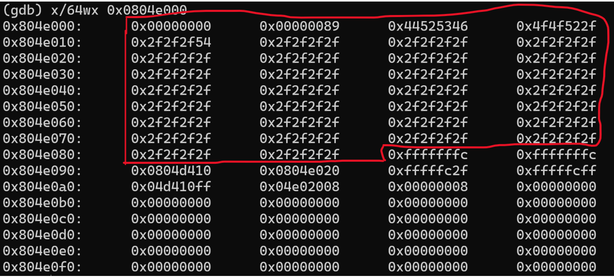
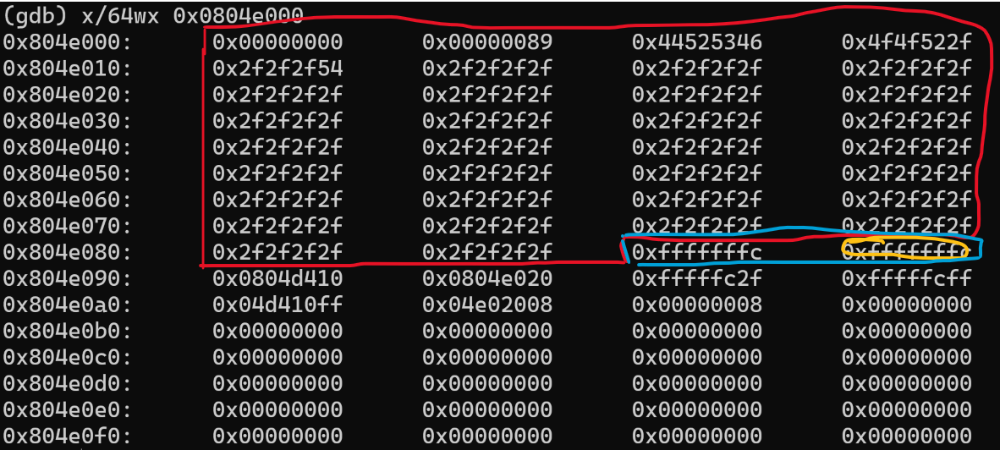
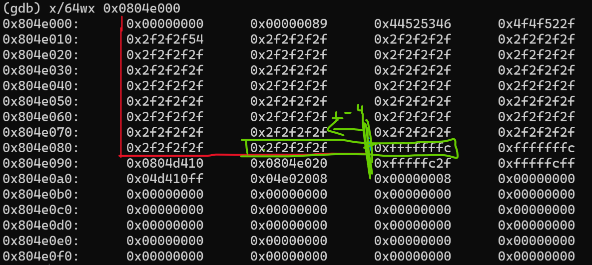
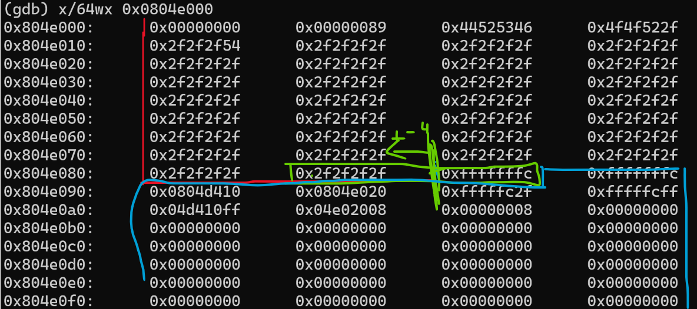
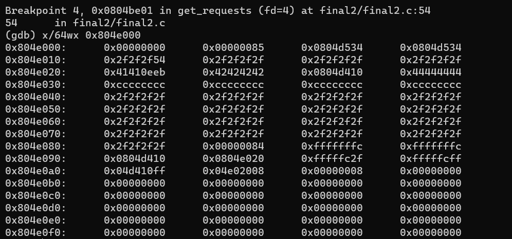
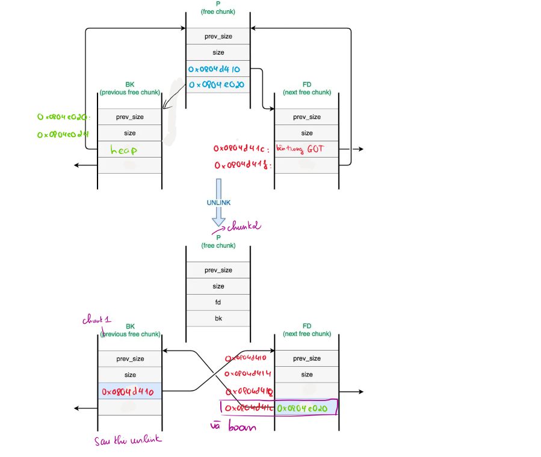
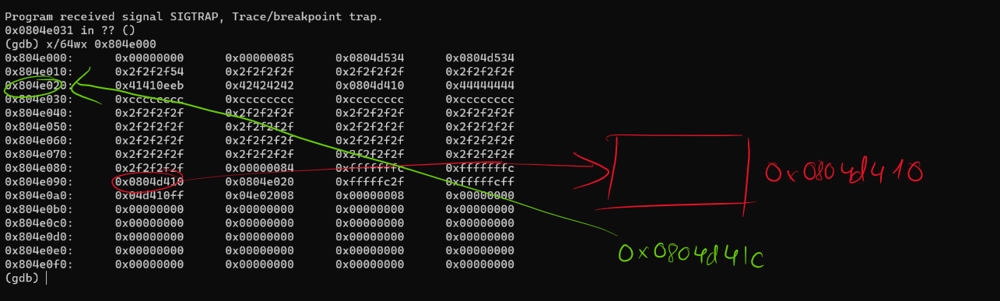

# Cơ chế unlink() trong heap exploit
- Phần này nói khá rõ trong heap3 rồi. ở đây chỉ lấy ví dụ thôi

## Ví dụ đối với final two
**Đây là chunk thứ nhất:**

- `0x89 = 137=136+1` biểu thị cho chunk này rộng 136 bit. bit 1 để biểu thị chunk ở trước chunk này đang được sử dụng. Hoặc chunk này là chunk đầu tiên.

**Chunk thứ hai**

khi chạy tiếp chương trình sẽ hiểu khối màu vàng là size của chunk tiếp theo. Do khối màu vàng này có giá trị là -4 nên chunk này sẽ là khối màu xanh lá.

**Phần xanh dương là chunk còn lại**

Lúc này nó sẽ thực hiện cơ chế unlink để ghi địa chỉ của shellcode vào bên trong got

vậy cơ bản thì nó sẽ hoạt động như thế này

# Reference
- https://github.com/ennorehling/dlmalloc/blob/master/malloc.c