# Heap three

Source code:
```c
#include <stdlib.h>
#include <unistd.h>
#include <string.h>
#include <sys/types.h>
#include <stdio.h>

void winner()
{
  printf("that wasn't too bad now, was it? @ %d\n", time(NULL));
}

int main(int argc, char **argv)
{
  char *a, *b, *c;

  a = malloc(32);
  b = malloc(32);
  c = malloc(32);

  strcpy(a, argv[1]);
  strcpy(b, argv[2]);
  strcpy(c, argv[3]);

  free(c);
  free(b);
  free(a);

  printf("dynamite failed?\n");
}
```

Trong bài này ta không thể áp dụng các lỗi như ở heap 1 và heap2 được nữa mà dùng đến các kĩ thuật hoàn toàn mới

## Heap
- Heap được sử dụng trong các chương trình C để quản lý bộ nhớ động. libc cung cấp một giao diện dễ sử dụng (malloc/free) để phân bổ và hủy phân bổ các vùng bộ nhớ. Phiên bản libc trong Protostar sử dụng cách triển khai malloc có tên là dlmalloc, theo tên của người sáng tạo ban đầu, Doug Lea. Các cấu trúc điều khiển được sử dụng bởi malloc được lưu trữ cùng băng với dữ liệu, cho phép thao tác với các cấu trúc điều khiển khi có thể xảy ra tràn bộ đệm heap, như trên.
- malloc() phân bổ bộ nhớ theo từng khối có cấu trúc sau:
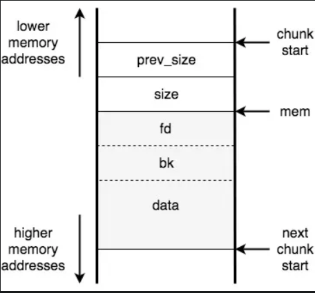

Trong đó, `prev_size` lưu kích cỡ của chunk trước đó, `size` lưu kích cỡ của chunk hiện tại. kích cỡ của chunk sẽ luôn chia hết cho 8 do bị alignment, điều này có nghĩa là 3 bit thấp nhất của size luôn bằng 0.
malloc() sử dụng ba bit này, đáng chú ý nhất là bit ít quan trọng nhất sẽ cho biết đoạn trước đó đang được sử dụng hay còn trống. Vì dụ, nếu chúng ta thấy 0x65 trong trường kích thước thì kích thước của đoạn hiện tại là 100 (hex 0x64) và đoạn trước đó đang được sử dụng. (0x65=0110 0101, bit cuối cùng là 1)
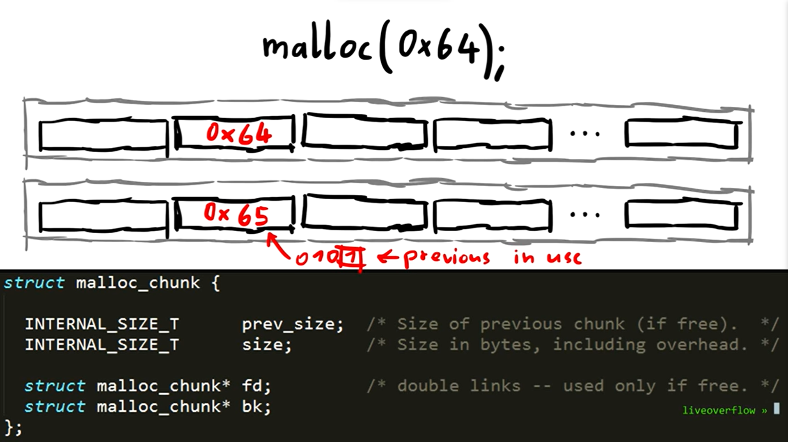

Khi malloc được gọi, nó sẽ khởi tạo prev_size và size rồi trả về địa chỉ của bộ nhớ ngay sau đó (mem trong hình trên). Các trường được mô tả là fd và bk bị bỏ qua đối với các đoạn đã sử dụng và bộ nhớ được sử dụng cho dữ liệu chương trình.
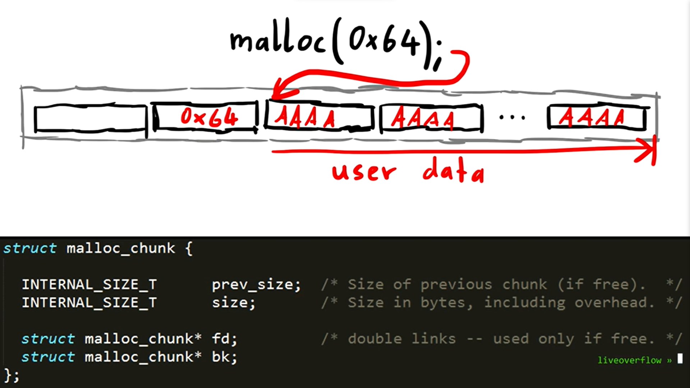

Khi một đoạn được free, nó được lưu trữ trong cấu trúc danh sách liên kết đôi và trường fd chứa địa chỉ của đoạn trống tiếp theo (con trỏ foward) và trường bk chứa địa chỉ của đoạn trống trước đó (con trỏ backward). Do đó, những con trỏ này ghi đè lên phần đầu của dữ liệu trong một đoạn không được sử dụng.

## Debug chương trình
> gdb./heap3
> set disassembly-flavor intel
> disass main
> b *0x080488d5
> b *0x080488ed
> b *0x08048905
> b *0x08048911
> b *0x0804891d
> b *0x08048929
> r AAAAAAAA BBBBBBBB CCCCCCCC
> info proc map
> 
> define hook-stop
> > x/54wx 0x804c000
> > x/2i $eip
> > end
>
> r

Bây giờ ta thấy heap trông như sau:
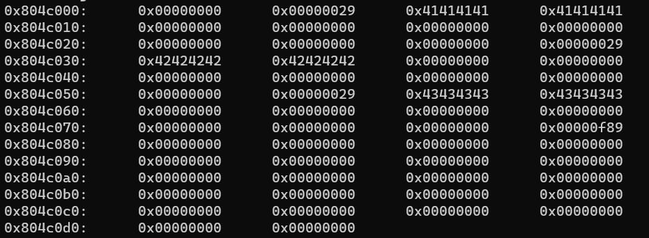
free(c), không có chuyện gì xảy ra
tiếp tục chạy đến free(b)
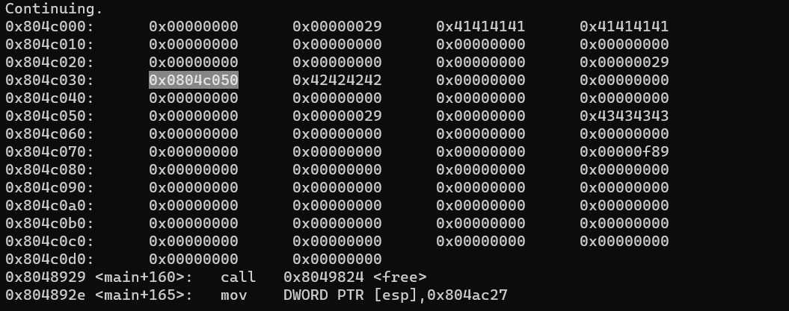
ta có thể thấy lúc này fd đã được ghi đè bởi vì chunk c hiện tại đã được giải phóng
điều tương tự cũng xảy ra đối với chunk a
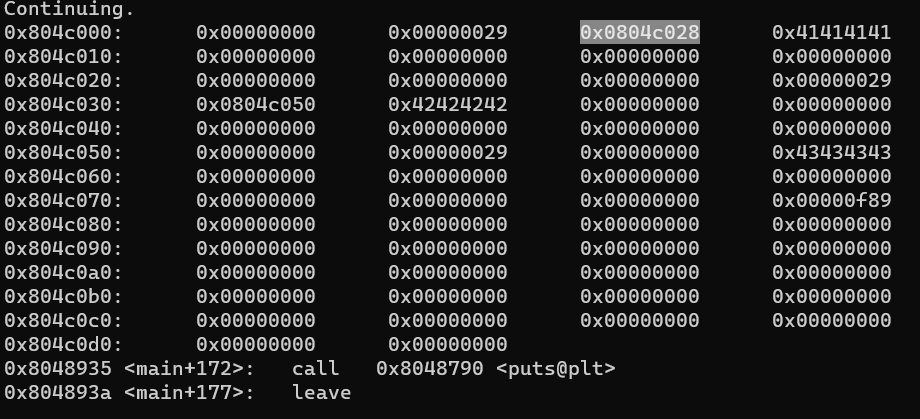
Ở đây có một câu hỏi là tại sao biến cuối cùng của size như 29 không được đặt về 0 để trở thành 28. 
=> do bộ đệm được phân bổ nhỏ. Khi một đoạn nhỏ hơn 64 byte (theo mặc định), malloc sẽ sử dụng cấu trúc dữ liệu đơn giản hóa (fastbin) và sẽ bỏ qua bit prev_size, bk và bit “previous chunk in use”.
Vậy tại sao chúng ta lại nói về tất cả các trường này nếu tất cả các phần đều nhỏ? Đối với mã khai thác, chúng ta sẽ cần các đoạn được malloc xử lý như các đoạn thông thường chứ không phải như các đoạn fastbin.

## Free 
Khi free được gọi trên một chunk, nếu có các chunk free liền kề với chunk được giải phóng (tức là ngay trước hoặc ngay sau), free sẽ hợp nhất chúng thành một chunk free lớn hơn. Các khối được giiar phóng được lưu trữ trong một danh sách liên kết đôi (bỏ qua các khối fastbin bây giờ) và khi thực hiện hợp nhất sẽ loại bỏ khối được giải phóng liền kề đang được hợp nhất khỏi danh sách vì nó sẽ trở thành một phần của khối mới, lớn hơn. Đây là những gì xảy ra về mặt khái niệm (có nhiều trường hợp cụ thể hơn, chẳng hạn như kiểm tra xem đoạn hiện tại có phải là đoạn cuối cùng trong heap không):
```c
if( next adjacent chunk is free ){
  unlink next adjacent chunk;
  increase the size of the current chunk to include next adjacent chunk;
}
if( previous adjacent chunk is free ){
  unlink previous adjacent chunk;
  increase the size of the previous adjacent chunk to include the current chunk;
}
```
- visualization:

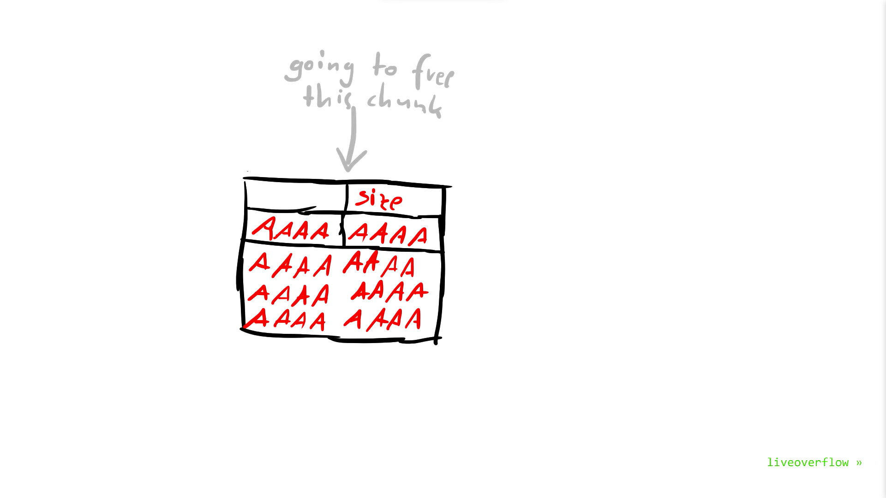
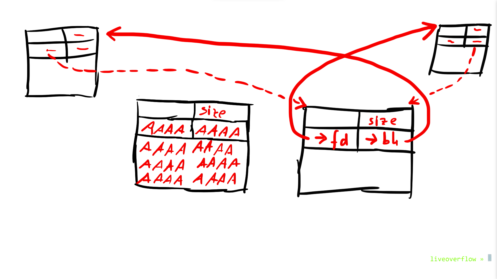
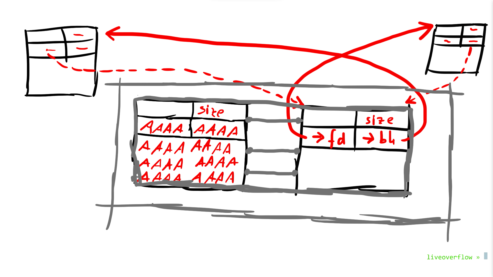
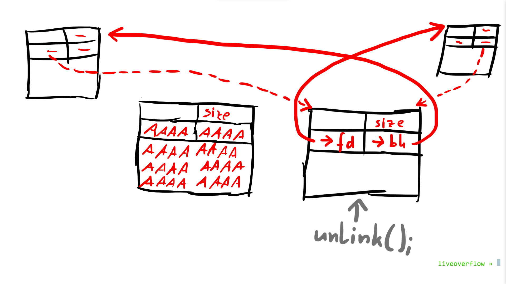
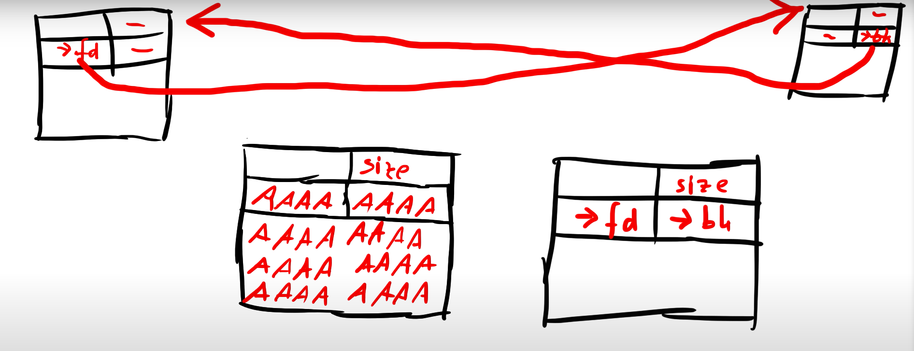
hoặc 
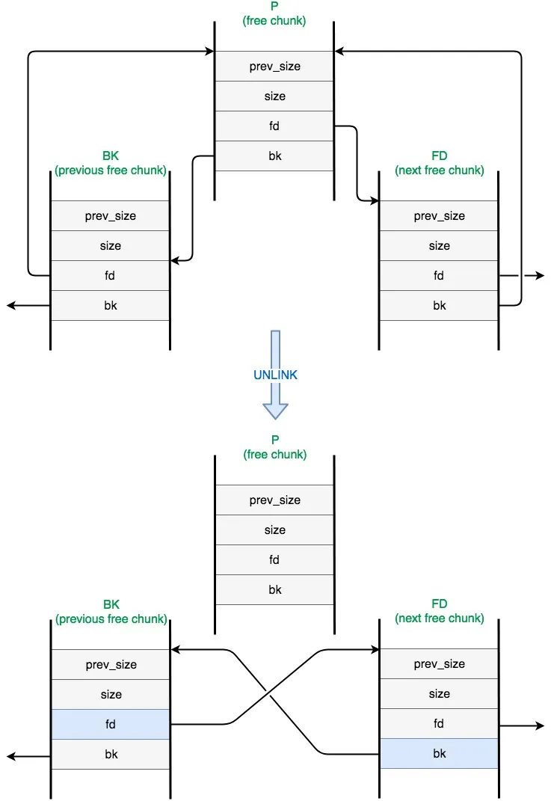

tổng hợp tất cả những gì đã có, mục tiêu của chúng ta là làm sao sau quá trình tham chiếu này GOT sẽ chưa địa chỉ của hàm winner().

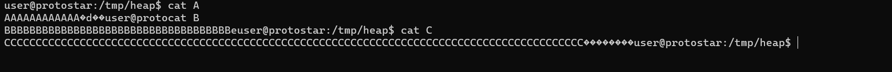
với hàm strcpy() ta có bộ nhớ heap có dạng như sau:
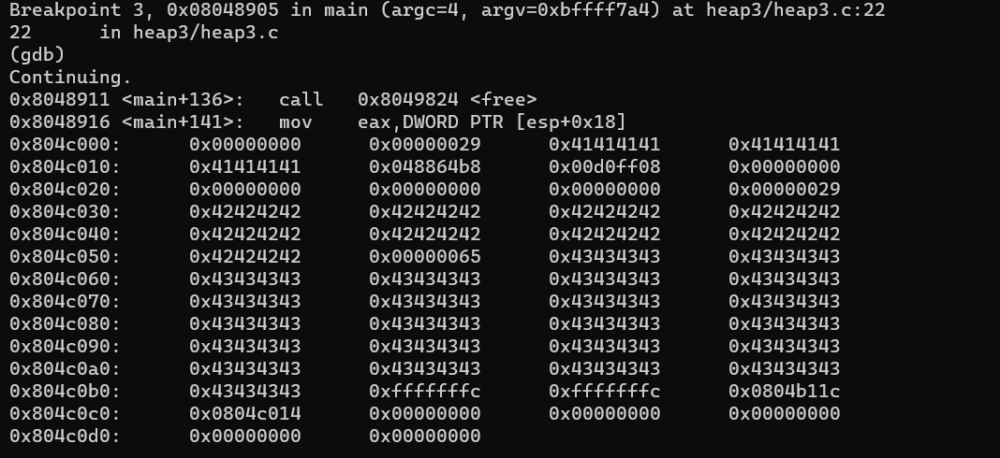
và free(c), lúc này thì shellcode sẽ được truyền vào bên trong địa chỉ của 
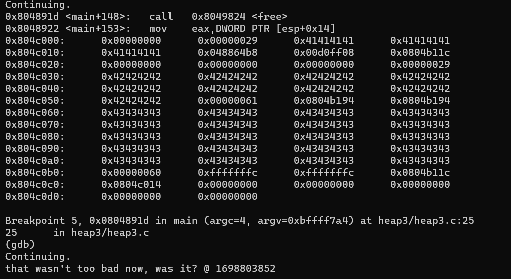
thử lại và không sử dụng gdb
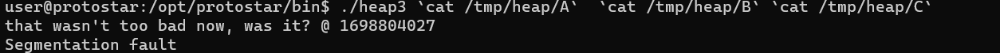