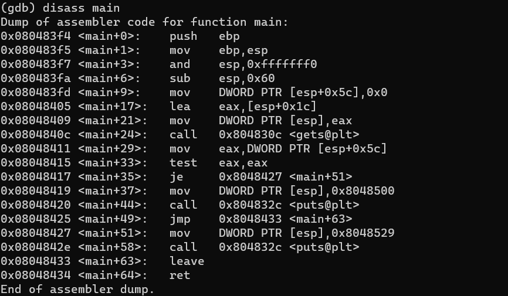
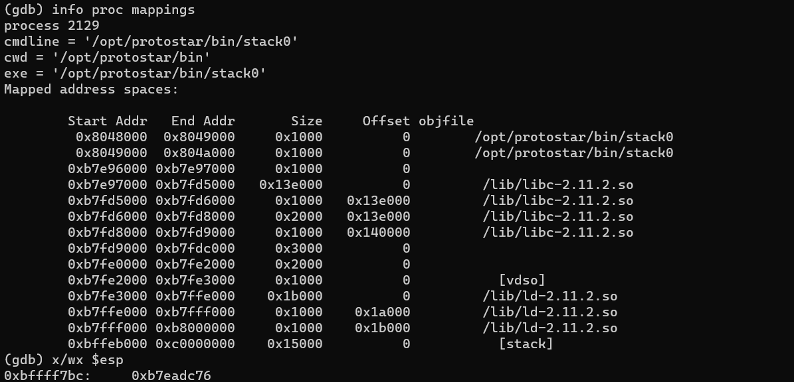
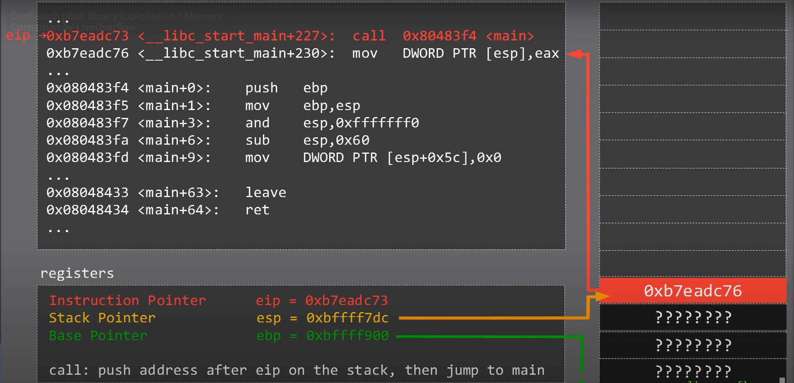
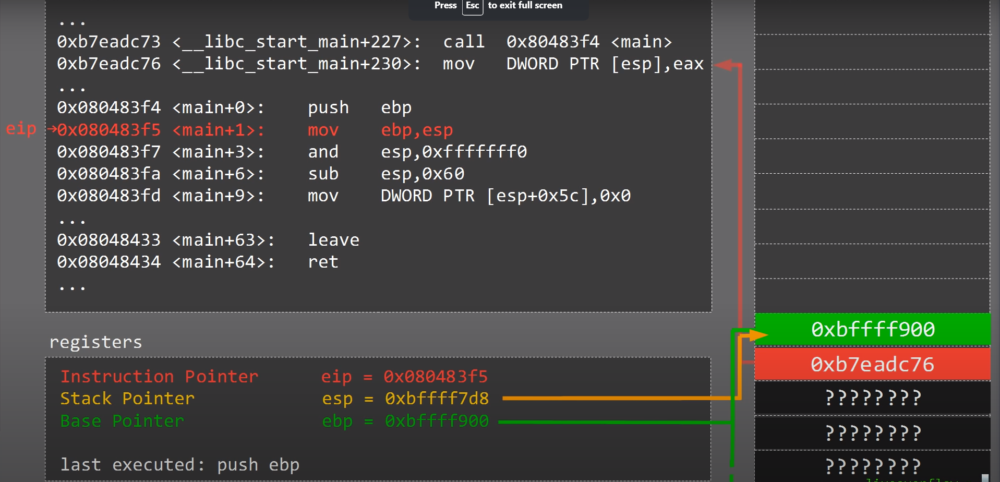
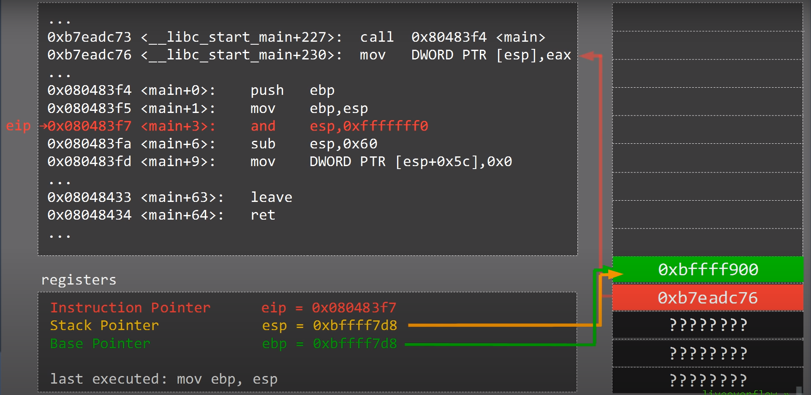
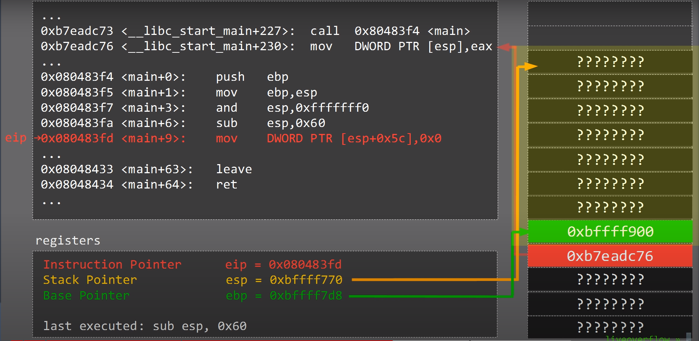
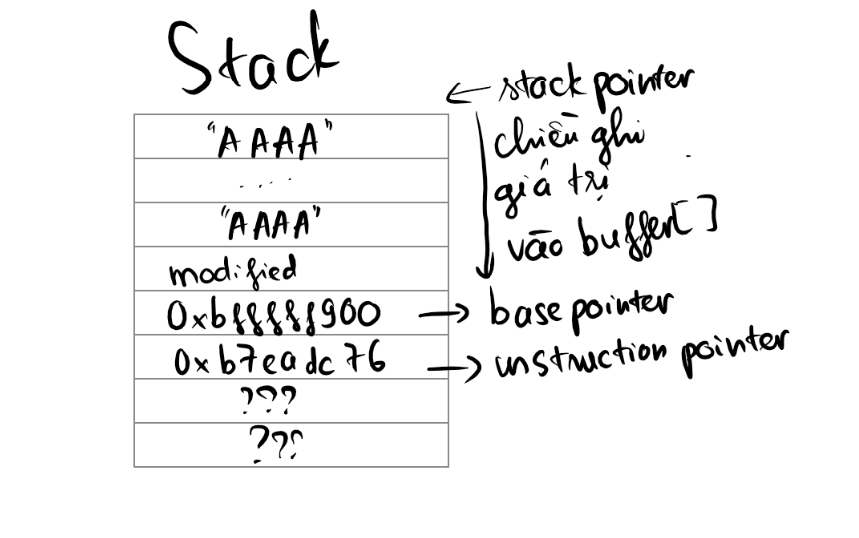
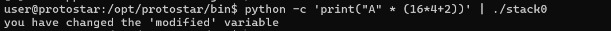

# Stack0

Source code:
```c
#include <stdlib.h>
#include <unistd.h>
#include <stdio.h>

int main(int argc, char **argv)
{
  volatile int modified;
  char buffer[64];

  modified = 0;
  gets(buffer);

  if(modified != 0) {
      printf("you have changed the 'modified' variable\n");
  } else {
      printf("Try again?\n");
  }
}
```

chương trình có 2 biến cục bộ, một số nguyên modified và một mảng char có độ rộng kí tự.
=> lỗi ở hàm get

debug với gdb
> gdb ./stack0
> b *main
> r
> set disassembly-flavor intel
> disass main
> info proc mappings

ta có hàm main như sau:


với breakpoint ở đầu hàm main. Lúc này, esp sẽ trỏ tới 


ban đầu stack và các thanh ghi có giá trị như sau:


với `eip` là thanh ghi lưu địa chỉ của lệnh tiếp theo cần được thực thi. trường hợp này là `0xb7eadc73`, là lệnh gọi hàm main
`esp` đang được lưu ở địa chỉ `0xbffff7dc` và chứa giá trị `0xb7eadc76` như ở bên trên đã chỉ ra
ebp lưu địa chỉ trả về của hàm main.

Sau khi gọi `0x080483f4 <main+0>:    push   ebp`


tiếp theo `0x080483f5 <main+1>:    mov    ebp,esp`


và `0x080483fa <main+6>:    sub    esp,0x60`


Đống vàng vàng nằm ở giữa ebp và esp này gọi là stack frame.
Đây là hoạt động khi bắt đầu hàm main.

Để ý các lện tiếp theo:
```asm
0x08048405 <main+17>:   lea    eax,[esp+0x1c]
0x08048409 <main+21>:   mov    DWORD PTR [esp],eax
0x0804840c <main+24>:   call   0x804830c <gets@plt>
```
lệnh lea tương tự như mov, nhưng thay vì di chuyển nội dung của một thanh ghi thì nó di chuyển địa chỉ của offset của một thanh ghi vào thanh ghi khác 
`0x08048409 <main+21>:   mov    DWORD PTR [esp],eax` sau đó dòng này đặt nó vào đỉnh của stack.
2 dòng này gọi là calling convention

quay lại với bài này


do buffer có độ rộng là 64 byte và biến modified chỉ chiếm 2 byte bộ nhớ nên để ghi đè ta cần tất cả:


Xong!