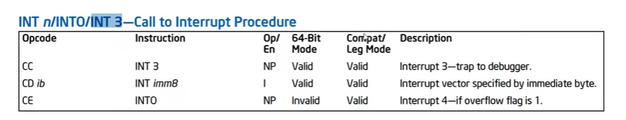

# Stack five

```c
#include <stdlib.h>
#include <unistd.h>
#include <stdio.h>
#include <string.h>

int main(int argc, char **argv)
{
  char buffer[64];

  gets(buffer);
}
```

có vẻ bài này cần đến shellcode để chiếm quyền root của hệ điều hành

Đầu tiên chúng ta phải tìm xem đâu là địa chỉ chúng ta cần để thay đổi $eip


ở đây $eip có giá trị `0x54545454` hay `TTTT`


Quay về với chương trình stack5 của chúng ta:
lúc này chương trình tự động đặt breakpoint 
1 câu hỏi to đùng là tại sao khi chạy chương trình dưới file truyền vào là `stack5` thì toàn bị lỗi

nhưng khi chạy `./stack5` với file truyền vào là `exp` thì mọi thứ đều bình thường duf 2 file này chả khác gì nhau


Câu trả lời là do tên của 2 chương trình này. Chúng có độ dài khác nhau nên biến môi trưởng biểu thị đường dẫn đến chúng khác nhau. Điều này dẫn đến việc địa chỉ stack của 2 chương trình cũng khác nhau luôn.


Chúng ta có thể xử lí chuyện này với  `rất nhiều nop`
payload được lấy từ shell-storm.org


cuối cùng, chúng ta lấy flag bằng cách


## Phụ lục
- Opcode '\xCC' và INT3


lệnh INT3 là một byte đặc biệt với opcode '\xCC' được thiết kế để gọi debug excption handler. byte '\xCC' này được dùng để thay thế byte đầu tiên của bất kì lệnh nào có breakpoint mà không cần phải ghi đè.
Cụ thể 1 trình gỡ lỗi sẽ hoạt động như này:


-  tại sao phải dùng `(python stack5.py ; cat) | /opt/protostar/bin/stack5`

